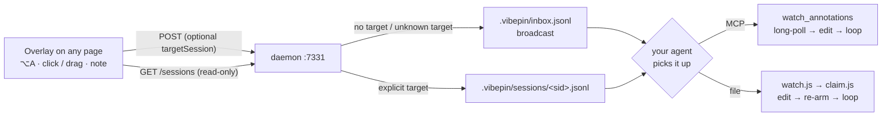

# vibepin

**Drop a pin on any UI, write what to change — your AI coding agent edits the source.**

[](https://yiwang3.github.io/vibepin)

In-browser visual annotation → local inbox → your agent picks it up and applies the change.
No screenshots, no copy-paste, no describing *which* element. Works on any Chromium page —
a web dev server **or** an Electron renderer — with React component + `file:line` detection.

- **Pin** an element or **drag a box** over a region, type a note, hit **Send**.
- Your agent drains the queue and edits the right file (React → component name + source line).
- Two pickup modes: a **zero-dep file watcher**, or an **MCP** `watch_annotations` tool.
- **Target one session or broadcast**: a note goes either to a specific parked session's
  private queue (explicit target) or to the project's shared inbox (no target) — see
  [Session routing](#session-routing-multi-session).
- Fully local. No cloud, no account, no API key.

Works with **Claude Code** out of the box; **Codex**, **Cursor**, **Antigravity**, and
**omp** (oh-my-pi) via `vibepin init --agent <name>` or the MCP tools — any MCP-capable
agent, really.

> 🌐 **Live demo** (press ⌥A right on the page): https://yiwang3.github.io/vibepin · ▶ [watch the demo](https://yiwang3.github.io/vibepin/demo.mp4)
> 📖 Chinese quickstart: [GETTING_STARTED.md](GETTING_STARTED.md)

## Quick start

### A. Try it (bundled examples)

```bash
git clone https://github.com/YIWANG3/vibepin
cd vibepin/examples/react-vite     # or web-vite / electron
npm install
npm run dev                        # opens a dev server (Electron: a window) with the overlay
```

1. Open the printed URL. Press **⌥A** (Option+A), click an element (or drag a box), type a note, hit **Send**.
2. Install the Claude Code command once, then restart Claude Code:
   ```bash
   npx vibepin init               # adds the /vpin slash command
   ```
3. In a Claude Code session **in that folder**, run **`/vpin`**. It watches the inbox and
   edits the right file every time you Send — React annotations even carry the component
   name + `file:line`.

### B. Use it in your own project

1. **Install:** `npm i -D vibepin`
2. **Inject the overlay** (dev only — pick one):
   - **Vite (web / React)** — in `vite.config.js`:
     ```js
     import vibepin from 'vibepin/vite';
     export default defineConfig({ plugins: [vibepin()] }); // after react()
     ```
   - **Next.js** — `withVibepin(nextConfig)` + a dev-only `<Script>` — see [adapters/nextjs.md](adapters/nextjs.md).
   - **Electron** — see [adapters/electron.md](adapters/electron.md).
   - **Anything else** — run `npx vibepin daemon`, then add
     `<script src="http://127.0.0.1:7331/annotate.js"></script>` to your dev HTML.
3. **Install the command:** `npx vibepin init` (once), then restart Claude Code.
4. Add `.vibepin/` to your `.gitignore`.
5. Start your dev server, open Claude Code in the project root, run **`/vpin`**, then annotate in the browser.

---

Below: architecture & reference.



The agent gets the annotation in one of two interchangeable ways — an **MCP**
`watch_annotations` long-poll, or a **zero-dep file watcher** (`watch.js` → `claim.js`).
Both can watch the shared inbox **and** a per-session queue (see
[Session routing](#session-routing-multi-session)).

The architecture constraint this respects: an MCP server / browser extension can
**never push** an agent turn — the agent (client) must initiate. So the wake is
always agent-side: either it parks in `watch_annotations` (MCP long-poll, same
pattern as vibe-annotations) or in a background `watch.js` that exits on change
and lets the harness re-invoke the agent. Same loop, two transports.

## Distribution (pick per target)

| Target | How to inject the overlay |
|---|---|
| **Owned web project** (Vite) | `devDependency` → `import vibepin from 'vibepin/vite'` — auto-spawns daemon + injects script in dev |
| **Next.js** | `withVibepin(nextConfig)` + a dev-only `<Script>` in your layout — see [adapters/nextjs.md](adapters/nextjs.md) |
| **Electron app** | dev-only `executeJavaScript` loader + optional pixel-perfect capture — see [adapters/electron.md](adapters/electron.md) |
| **Any page / not yours** | `<script src="http://127.0.0.1:7331/annotate.js">`, a bookmarklet, or a thin browser extension that injects the same line |

The overlay (`core/annotate.js`) is one file, identical everywhere. Only the
injection vector differs.

## Standalone daemon (no project)

```bash
npx vibepin daemon                    # serves overlay + demo + collects annotations
open http://127.0.0.1:7331/           # demo page; press ⌥A, click, type, Send
```

## Runnable examples

- [examples/web-vite](examples/web-vite) — plain browser project; integration is one
  Vite plugin that auto-spawns the daemon and injects the overlay. `npm install && npm run dev`.
- [examples/react-vite](examples/react-vite) — React app; annotations carry the
  **component name + source file:line** (not just a selector). `npm install && npm run dev`.
- [examples/nextjs](examples/nextjs) — Next.js (App Router); `withVibepin` auto-starts the
  daemon, overlay injected via a dev `<Script>`. `npm install && npm run dev`.
- [examples/electron](examples/electron) — Electron app; main.js injects the overlay
  in dev and exposes `capturePage` for pixel-perfect crops. `npm install && npm run dev`.

## Two gestures — no mode switch

- **Click** an element → element annotation. Hover-highlights first. On React dev
  builds the payload includes `component` + `source` (from the fiber's `_debugSource`,
  or a `data-source` attribute fallback for React 19 / inspector plugins).
- **Drag** a box (>5px) → region annotation. Captures the box `rect` and the
  `elements` (with components) inside it. For "this whole row is cramped" feedback
  that isn't a single node.

Shortcuts: **⌥A / Alt+A** toggle · **Esc** exit. The hotkey is never the only way in — a
mini toggle sits permanently at the bottom-right of the page (tap it, or hover to read its
state), and with the browser extension installed the toolbar button offers the same switch
for the tab you are on.

## The Claude Code loop

### Recommended: the `/vpin` command

`/vpin` is a Claude Code slash command — it lives in Claude Code's config, not in
node_modules, so npm can't install it. A CLI does:

```bash
npx vibepin init     # writes ~/.claude/commands/vpin.md — then restart Claude Code
```

Then in any project, run **`/vpin`**. It parks a background file watcher and hands
control back to you; each time you Send annotations it wakes, edits the right files,
and re-arms. **Zero idle token cost** — the waiting happens in a shell process, not
the model — and you can keep typing other requests in the same window.

Under the hood it loops `vibepin watch --queue .vibepin/sessions/<sid>.jsonl --session <sid>`
(blocks until your queue **or** the shared inbox changes) → `vibepin claim` with the same
two flags (drains both, prints one de-duplicated JSON array, archives to `processed.jsonl`)
→ edit → re-arm with the same `<sid>`.

### Alternative: MCP watch mode

Register the daemon's `/mcp` and tell Claude Code **“start watching vibepin”**:

```bash
claude mcp add --transport http vibepin http://127.0.0.1:7331/mcp
```

Tools: `watch_annotations` (long-poll), `list_annotations`, `resolve_annotation` — each
takes an optional `sessionId`, so an MCP session can read its own queue plus the shared
inbox (without it you get the shared inbox only, exactly as before). Never use MCP's
connection-level `mcp-session-id` as a routing key: it is random and dies on reconnect.
Note: the agent **polls**, so it keeps spending tokens while idle — fine for
hands-free, worse for cost. Needs `npm install` (pulls `@modelcontextprotocol/sdk`).

## Other agents (Codex · Cursor · Antigravity · omp)

The loop is agent-agnostic — only the wiring differs. `init` writes that agent's
`/vpin` command/prompt (the token-cheap file-watcher loop) and prints its MCP
snippet as the alternative. Which wake path each agent can actually take:

| Agent | Wake path(s) it can use | How a session id gets in |
| --- | --- | --- |
| **Claude Code** | file watcher (`/vpin`, background job) · MCP long-poll | `--session <sid>` / tool arg `sessionId` |
| **omp** | file watcher (the job *exiting* re-enters the session) · MCP | `--session <sid>` / tool arg `sessionId` |
| **Codex** | file watcher (`/vpin` prompt) · MCP (stdio bridge `mcp-remote`) | `--session <sid>` / tool arg `sessionId` |
| **Cursor** | file watcher (`/vpin` command) · MCP (native HTTP) | `--session <sid>` / tool arg `sessionId` |
| **Antigravity** | **MCP only** — nothing on its side can park a watcher, so the lease is upserted by the daemon | tool arg `sessionId` |

Why the last row is narrower: a wake has to be **agent-side**
([adapters/omp.md](adapters/omp.md)) — the daemon, the MCP server and the browser extension
can never push a model turn. Codex additionally cannot heartbeat over HTTP at all (its
shell is network-sandboxed), which is why all heartbeats are file writes.

The one-command wiring per agent:

```bash
npx vibepin init --agent codex        # ~/.codex/prompts/vpin.md
npx vibepin init --agent cursor       # .cursor/commands/vpin.md (run in your project)
npx vibepin init --agent antigravity  # MCP-only — prints the snippet to register
npx vibepin init --agent omp          # project wiring (below); --root <dir> to target another project
npx vibepin init --agent omp --upgrade # rewrite omp's SKILL.md + AGENTS.md section after a protocol change
npx vibepin init --agent all          # all of the above + Claude Code
```

omp (oh-my-pi) is the one target with no agent-side command file: it reads `AGENTS.md`
by itself, so `init --agent omp` wires the *project* instead — a seeded
`.vibepin/config.json`, a `.gitignore` rule, the `vibepin-annotations` skill at
`.omp/skills/`, and a `## 注记（vibepin）` section in `AGENTS.md` holding the exact
`watch → claim` commands. For **omp** it is idempotent — existing files are **reported,
never rewritten** (so an already-wired project needs `--upgrade` to pick up a protocol
change) — and `--dry-run` prints the plan without touching disk; `--vibepin-dir <dir>`
points the generated commands at a specific checkout instead of the installed package.
The `claude` / `codex` / `cursor` targets are deliberately the opposite: `init`
**overwrites** their command/prompt files (`copyFileSync`), which is exactly what makes a
re-run an upgrade.

Per-agent details: [adapters/codex.md](adapters/codex.md) ·
[adapters/cursor.md](adapters/cursor.md) · [adapters/antigravity.md](adapters/antigravity.md) ·
[adapters/omp.md](adapters/omp.md).
All transports read the shared `.vibepin/inbox.jsonl` and, when a session id is given, that
session's own queue — see [Session routing](#session-routing-multi-session).

## Session routing (multi-session)

A project can have several parked sessions at once (two Claude Code windows, an omp session,
a Codex session…). vibepin keeps them apart with **explicit targets, isolated queues, and
UI-only liveness**:

- **Delivery is explicit, never guessed.** A note either carries a target or it doesn't.
  With a target it is appended **only** to `.vibepin/sessions/<sid>.jsonl`; without one it
  goes to the shared `.vibepin/inbox.jsonl`, exactly as before. If the target has no lease
  record any more, the daemon degrades to broadcast and says so
  (`routed:"broadcast", degraded:true`) — it never picks a session on its own.
- **One queue per session, no shadow copies.** `claim.js` takes whole files by atomic
  rename, so isolation has to be at the file level; a copy in the shared inbox would be
  claimed by whichever session got there first and would wake every other session for
  nothing. Only the numeric audit trail (`.vibepin/routed.jsonl`, `claims.jsonl`) records
  routing, and it holds metadata only — no note text.
- **Liveness is display-only.** `.vibepin/sessions/<sid>.json` is a lease refreshed by the
  parked watcher (and upserted by the daemon for MCP sessions); `GET /sessions` reports
  `lastSeenAt` / `pending` for the panel, and a stale lease changes only the label
  ("last active N minutes ago") — never whether a note is delivered.
- **Sessions are plain files, not a service.** The registry lives on disk in
  `.vibepin/sessions/*.json`; there is **no HTTP write endpoint**, so a page can neither
  register nor hijack a session. `GET /sessions` is read-only and returns just
  `{sessionId, agent, label, lastSeenAt, pending, mode}` — never `cwd`, `pid`, or absolute
  paths.
- **Reading it back.** The panel pre-fills the only session when exactly one is parked,
  lists candidates when there are more, and the toast reports the real outcome
  (`Sent 2 → omp-2f9c1a` / broadcast / degraded). From a shell:
  `npx vibepin sessions` (list sid · agent · label · last activity · pending) and
  `npx vibepin claim --queue .vibepin/sessions/<sid>.jsonl`.

Upgrading an already-wired project — and what happens if you don't — is covered in
[docs/20260918-session-routing-migration.md](docs/20260918-session-routing-migration.md).

## Overlay UX

- **Alt+A** toggle. Hover highlights; the tag shows `tag#id.class`.
- Click → popup with the resolved CSS selector → type a note → **Add** (or ⌘/Ctrl+Enter).
- Bottom-right panel batches them; **Send** POSTs the batch. **Esc** exits.
- **Copy** serializes the batch to a plain-text block (component + `file:line`, note,
  region elements, page URL) and puts it on your clipboard — paste it into *any* agent
  (Claude Code, Codex, Cursor, ChatGPT, …). **Zero setup**: no daemon pickup, no watch
  loop, no MCP — the lowest-friction, fully non-invasive way to hand off.
- Each annotation carries: `selector`, `rect`, truncated `outerHTML`, a curated
  `getComputedStyle` subset, `note`, `url`, and (if `window.__vibepinCapture` exists) a screenshot.

## Notes

- Daemon binds `127.0.0.1` only. Inbox path is fixed at startup so the watcher is unambiguous.
- One daemon serves many pages; point it at the inbox of whichever repo Claude Code is editing.
- No agent self-verification by design — you stay the aesthetic judge; the loop only removes the handoff friction.
