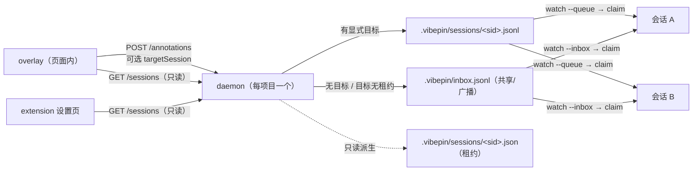

# 2026-09-18 会话级路由设计（Session Routing for vibepin）· v2 定稿

> 状态：**定稿，可直接开工**。本文件是**独立规格**——`§4`/`§5`/`§6` 是完整契约，`§7` 是必须同批修的主干缺陷，`§11` 是迁移清单；实施者不需要读评审报告。
> 范围：`daemon/`、`extension/`、`core/annotate.js`、`bin/vibepin.js`、`adapters/`、`docs/`
> 目标读者：vibepin 维护者 + 实现代理
> 相关文档：`README.md`（两种 pickup transport）、`adapters/omp.md`（"Why not MCP: the wake has to be agent-side"）、`docs/omp-integration.md`
> 评审记录（含 v1 被推翻的四处）见 `§13`。文中 `文件:行` 引用的行号基于本文件写作当次的仓库快照，**行号会漂，认代码形状不认行号**。

---

## 1. 背景与问题

### 1.1 现状（含证据）

| 事实 | 证据 |
| --- | --- |
| inbox 是**项目级**文件：`.vibepin/inbox.jsonl` | `daemon/store.js:16-21`、`daemon/claim.js:14-20`、`daemon/watch.js:13-17` |
| daemon 按**项目**启动（`cwd`/`--config` 决定读哪个 `.vibepin/config.json`），端口 7331–7370 里取第一个空闲 | `daemon/daemon.js:22-23,40,109-113,280-283`、`adapters/vite.js:34-38,183-186`、`extension/discover.js:12-16` |
| 扩展按端口**并行探测** `/health` 找 daemon；只有带 `inbox` + **数字** `port` 的响应才算 daemon | `extension/discover.js:29-37` |
| 扩展设置页**已经显示** endpoint / `inbox` / `project` / `pending` | `extension/options.js:13-15,23-46` |
| `config.json` 的 `agent` **只是面板显示名** | `daemon/daemon.js:91-92` 原注释：*"'agent' is only the overlay's display name; the Vite plugin reads it, this process does not"*；链路：`adapters/vite.js:198-199` → `core/annotate.js:34` → `core/annotate.js:68,87` |
| 两种 pickup transport 等价：文件 watcher（`watch.js` → `claim.js`）/ MCP `watch_annotations` | `README.md:64-80`、`daemon/mcp.js:19-46` |
| **唤醒必须由 agent 侧发起**（MCP server / 扩展**无法** push 一个 agent turn） | `README.md:76-80` 原话：*"an MCP server / browser extension can never push an agent turn — the agent (client) must initiate"*；`adapters/omp.md:14-27` |
| `claim` 是**整文件** rename 后全批取走，**没有任何目标过滤** | `daemon/claim.js:25-26,35,40-41` |
| `watch` 是**纯字节计数**，只看 `size` 变大 | `daemon/watch.js:20-24,32-34` |
| daemon 的 CORS 是 `Access-Control-Allow-Origin: *`，且**每个响应**都带、`OPTIONS` 直接放行 | `daemon/daemon.js:128-132,156-157,166` |
| daemon 的生命周期绑在 dev server 上（Vite 插件 spawn，dev server 退出即 kill） | `adapters/vite.js:183-186,200-202,222` |
| `store.js` 的各函数（`readPending`/`size`/`resolveByIds`/`waitForPending`）**全部闭包在单个 INBOX** | `daemon/store.js:16,19-21,41-49,54-63` |
| MCP 的 `resolve_annotation` 回执把 **`store.size()`（字节数）**当成 pending 条数上报 | `daemon/mcp.js:43-44` + `daemon/store.js:31-33` |

### 1.2 问题

**"这条注记该给谁" 未定义。** 现状是"项目级 inbox + 抢占式（first-claimer-wins）"：

- 同一项目上同时开着 **多个 agent**（omp / PI / codex / cursor / antigravity）或 **同一 agent 的多个会话**时，注记会被**任意一个**会话抢走。`adapters/omp.md:228-230` 原话：*"Claim is first-come-first-served … the first `claim` gets the batch, the other gets `[]`. Keep exactly one parked watcher per inbox."*
- `config.json.agent` 既不是路由依据（daemon 不读，`daemon/daemon.js:91-92`），也无法区分会话。
- 用户侧没有任何"当前有哪些活跃会话、这条会发给谁"的可见性：面板的去向行只显示 `/health.inbox`（`core/annotate.js:917-928`），后端回执只报条数（`core/annotate.js:766`）。

### 1.3 为什么现在做

- 实际使用已进入"多 agent + 多会话"场景；错投会让人以为是工具坏了。
- 我们的真实用例：**在浏览器里对原型/页面做注记，交给"当前正在改这个项目"的那个会话**。

### 1.4 三条不变量（本设计的全部重量）

违反其中任意一条，本设计就退回 v1 的错误集合。所有实现细节都必须能由这三条推出：

1. **daemon 的写盘规则里不出现任何会话状态。**
   有显式目标 → 写 `sessions/<sid>.jsonl`；没有 → 写共享 `inbox.jsonl`（**逐字等于今天**）。没有"猜"的分支。
2. **会话表由项目内的文件派生**（`.vibepin/sessions/*.json`），daemon 只提供**只读** HTTP 视图；**不新增任何写接口**。
3. **判活只影响展示**（排序、文案、提示），**绝不作为投递资格判据**。

> 这三条换来的是：判活错判不再等于错投（不变量 3）、页面无法伪造会话（不变量 2，页面没有 fs 写权限）、老客户端行为可证不变（不变量 1）。

---

## 2. 目标与非目标

**目标**

1. 注记可**定向**投递给某个**项目内的某个会话**；不确定时不猜、不丢。
2. 对**现有使用方式零破坏**：老客户端（不带目标）行为**逐字不变**。
3. 对 4 类 agent（omp / codex / cursor / antigravity，以及任何 MCP 客户端）**都能用**，不要求它们支持新协议之外的东西；**心跳只用文件写**（见 `§6`，Codex 沙箱掐网络）。
4. 用户**可见**：能看到活跃会话、"这条会发给谁"、"上一条是谁认领的"。

**非目标**

- ❌ 不做云端 / 账号 / 远程同步（P5 才考虑，见 `§14`）。
- ❌ 不改 overlay 的采集契约（`selector` / `html` / `styles` / `rect` 等字段不变）。
- ❌ 不引入第二门语言（Rust/Go）——见 `§14` P5。
- ❌ 不要求 agent 侧新增"被推送"的能力（架构上不可能，`README.md:76-80`）。
- ❌ **不新增任何 HTTP 写接口**（v1 的三个写端点在 `§13` 被推翻）。

---

## 3. 设计总览



要点：

1. **注册表在文件系统**（`.vibepin/sessions/`），不是 daemon 内存、不是 HTTP 写端点：daemon 随 dev server 重启（`adapters/vite.js:200-202,222`）也不会丢会话表。
2. **每会话一个队列文件**，而不是"一个文件加目标字段"（理由见 `§5.4`）。
3. **共享 inbox 保留**为默认/广播通道——老客户端、无会话场景、以及"没指定目标"的注记都走它。
4. **唤醒机制不变**：仍是 agent 侧（文件 watcher 阻塞在 shell / MCP long-poll）。
5. **overlay 是唯一能回答"这条发给谁"的地方**（`file://` 页面上没有扩展，`§9`）。

---

## 4. 会话注册表与只读 HTTP 契约

### 4.1 目录布局

```text
<proj>/.vibepin/
  config.json         # 已存在，本设计不改（agent 仍是显示名，daemon/daemon.js:91-92）
  inbox.jsonl         # 共享 inbox：广播 + 无目标；格式不变
  processed.jsonl     # claim 的归档；格式不变
  sessions/
    <sid>.json        # 会话记录（租约）；daemon 只读
    <sid>.jsonl       # 该会话的队列；由 daemon 在 POST 时按需 mkdir+append 创建
  routed.jsonl        # 降级/路由审计（append-only；没有任何 watcher 监听它）
  claims.jsonl        # 认领审计（append-only；供"最后认领"显示 + MCP resolve 记账）
  sessions/.token     # 仅当未来需要 MCP HTTP 写时存在（0600，见 §10）
```

**`sid` 规范（必须逐字实现，否则是路径遍历）**

- 格式：`^[a-zA-Z0-9][a-zA-Z0-9._-]{0,63}$`（点允许出现在中间，**首字符必须是字母或数字** ⇒ 排除 `.` 与 `..`）。
- 推荐形状（由 CLI 生成）：`<agent-slug>-<6位hex>`，例：`omp-2f9c1a`（≤24 字符）。
- 任何接受 `sid` 的入口（`POST /annotations` 的 `targetSession`、MCP 工具参数、`--session`）都必须：
  1. 用上面的正则校验，**不匹配 → 400 / 报错退出**，不写盘；
  2. 拼路径后断言 `dirname(resolve(join(SESSIONS, sid + '.jsonl'))) === resolve(SESSIONS)`。
- 为什么必须校验：`targetSession` 来自**页面**（`core/annotate.js:757` 的 POST body），而 daemon 的 CORS 是 `*`（`daemon/daemon.js:128-132`）——没有校验，`../` 就能逃出 `.vibepin/`。

> **为什么 `sid` 必须"构造上就短"**：`GET /sessions` 只回短 id（`§4.4`），而 overlay 要把这个 id **原样回投**（`§5.2`）。所以不能对 id 做截断，只能约束生成规则使其本来就短。

### 4.2 会话记录 `<sid>.json`（租约）

```json
{
  "agent": "omp",
  "label": "改简历解析页",
  "pid": 4312,
  "watcherPid": 4488,
  "cwd": "D:/Develops/talents-py",
  "mode": "file",
  "startedAt": "2026-09-18T10:22:31Z",
  "lastClaimAt": 1758182462000,
  "lastReArmAt": 1758182465000
}
```

| 字段 | 谁写 | 含义 |
| --- | --- | --- |
| `agent` | watch.js（CLI 参数/`VPIN_AGENT`） | `omp \| codex \| cursor \| antigravity \| mcp \| …`（自由字符串，仅显示） |
| `label` | watch.js（`--label`，可缺省） | 给人看的一句话 |
| `pid` | watch.js（可缺省） | agent 会话进程（可空；**永不进 HTTP 响应**） |
| `watcherPid` | watch.js（`process.pid`） | 持有租约的那个 park 进程（**永不进 HTTP 响应**） |
| `cwd` | watch.js（`process.cwd()`） | 会话工作目录（**永不进 HTTP 响应**） |
| `mode` | watch.js / daemon(MCP) | `file` \| `mcp` |
| `startedAt` | watch.js（首次创建） | 时间戳（ISO） |
| `lastClaimAt` | claim.js `--session` | 上次 claim 结束时间（ms） |
| `lastReArmAt` | watch.js | 上次 park 时间（ms） |

**写规则**

- 只有三种写入者：`watch.js`（创建/刷新 + 心跳）、`claim.js --session`（刷 `lastClaimAt`）、**daemon 自己**（仅 MCP 模式下在工具调用时 upsert，`§8.2`）。**没有别的写者**，也不存在 HTTP 写路径。
- 写入方式：**写临时文件 + rename**（原子），避免 1s 轮询读到半截 JSON。
- **心跳**（`§6`）：`watch.js` 在 park 期间每 ~20s 用 `fs.utimes()` 刷新该文件的 mtime（不重写内容，零解析成本）。
- 文件**存在** = "该 sid 有租约记录"。这是定向投递的**唯一**资格条件。

### 4.3 队列 `<sid>.jsonl`

- 一行一条注记，格式与共享 inbox **逐字相同**（daemon 的白名单落盘，`daemon/daemon.js:193-217`）。
- 由 daemon 在 POST 时创建：`mkdir(dirname(queue), {recursive:true})` + `appendFile`。这与今天的写法一致（`daemon/daemon.js:219`），不需要注册时"预定"路径。
- **文件不存在是正常状态**（没有未决注记），不是"会话已死"的信号——判活只读 `§4.2` 的记录与 mtime。

### 4.4 只读视图：`GET /sessions` 与 `/health`

daemon 用 **readdir + stat 轮询**（照 `daemon/store.js:54-63` 与 `daemon/watch.js:32` 现有的 400ms `setInterval` 风格：本项目取 **1000ms**）维护一份快照，请求时直接返回快照。

```http
GET /sessions
→ 200 {
  "sessions": [
    { "sessionId": "omp-2f9c1a", "agent": "omp", "label": "改简历解析页",
      "lastSeenAt": 12, "pending": 2, "mode": "file" }
  ],
  "lastClaim": { "sessionId": "omp-2f9c1a", "at": 1758182462000, "count": 2 }
}
```

> `sessions` 之外**顶层还有 `lastClaim`**（加法字段，`daemon/daemon.js` 的 `readLastClaim()`）：`claims.jsonl` 的最新一行的元数据投影，`null` = 文件不存在或没有可解析行。它服务 `§9.4` 的「最后认领」显示，不含 id 列表、不含任何路径。

| 字段 | 说明 |
| --- | --- |
| `sessionId` | `§4.1` 的 `sid`，**原样返回**（构造上就短，见 `§4.1` 注） |
| `agent` / `label` / `mode` | 显示用，取 `§4.2` 的记录 |
| `lastSeenAt` | **相对秒**：`floor((now - max(记录 mtime, lastClaimAt, lastReArmAt)) / 1000)`；MCP 且在飞（parked）时恒为 `0` |
| `pending` | 该会话队列的**未认领条数**（`store.count()`：可解析的 JSON 对象行 − `claims.jsonl` 已记 id；**不是字节数**——`daemon/mcp.js:44` 的旧错——**也不是裸行数**，裸行数是另一个 `countLines()`，见 `§7.3`） |
| `lastClaim`（**顶层，不在 `sessions[]` 里**） | `claims.jsonl` 最新一行的元数据 `{ sessionId, at, count }`（`count` = 该批 id 数；`at` 缺失时为 `0`）；无记录时整个字段为 `null`。**纯元数据，不含 id 列表/路径/正文**，与 `sessions[]` 各行适用同一约束（`§9.4` 要求暴露它） |

排序：`lastSeenAt` 升序（最新在前）。

🔴 **`GET /sessions` 绝不返回** `cwd` / `pid` / `watcherPid` / 队列绝对路径 / inbox 绝对路径 / projectRoot。
原因：daemon 的 CORS 是 `Access-Control-Allow-Origin: *`（`daemon/daemon.js:128-132`），且 `OPTIONS` 直接 `204` 放行（`daemon/daemon.js:166`）——**任何能到达该端口的页面都能读到响应**。实测（本机 Chrome，daemon-like 服务）：`file://` 页、`http://127.0.0.1:<port>` 同源页、`<iframe sandbox>` 内的脚本都能成功 `fetch` 到这个端口的 GET，见 `§10` 表。

```http
GET /health
→ 200 { "ok": true, "inbox": "…", "pending": 0, "port": 7331,
        "projectRoot": "…",              # 已存在，保留（见下）
        "sessions": 2, "pendingTotal": 3 }   # 新增
```

- `inbox`（字符串）与**数字** `port` **不可删**：`extension/discover.js:37` 的判定是 `typeof info.inbox === 'string' && info.inbox && Number.isFinite(info.port)`，删了扩展就再也发现不到 daemon。
- `pending` **语义不回归**：共享 inbox 的条数（即 `daemon/daemon.js:145-152` 的 `countPending()`）。
- 新增 `sessions`（会话数）与 `pendingTotal`（共享 inbox + 所有会话队列的未认领条数）。
- `projectRoot` 与 `inbox` 的绝对路径暴露是**既有事实**（`daemon/daemon.js:179,182`），本期保留（发现逻辑依赖 `inbox`）；**不要再加任何敏感字段**——这是本条的实质约束。

### 4.5 写盘规则（daemon 侧唯一规则）

`POST /annotations` 的 body 新增可选 `targetSession`：

| 情形 | 落盘 | 响应 | 审计 |
| --- | --- | --- | --- |
| 带 `targetSession`，且 `<sid>.json` **存在** | **只** append 到 `sessions/<sid>.jsonl` | `{ ok:true, received:N, routed:"session", target:"<sid>", pending:<该队列未认领条数> }` | `routed.jsonl` 一行（元数据） |
| 带 `targetSession`，但 `<sid>.json` **不存在**（= 未知目标） | append 到**共享 inbox**（逐字同今天） | `{ ok:true, received:N, routed:"broadcast", degraded:true, reason:"unknown-session", target:"<sid>", pending:<共享 inbox 条数> }` | `routed.jsonl` 一行（含 `degraded:true`） |
| 不带 `targetSession` | append 到**共享 inbox**（**逐字等于今天**，`daemon/daemon.js:186-221`） | `{ ok:true, received:N, routed:"broadcast", pending:<共享 inbox 条数> }` | 不写（与今天一致） |
| `targetSession` 非法（正则/逃逸） | 不写盘 | `400 { error:"bad targetSession" }` | — |

**必须守住的两条**

1. **定向注记只写目标队列**，**绝不**在共享 inbox 留一份"影子副本"（v1 §4.2 的做法被 `§13` 推翻，理由：`daemon/claim.js:35,40-41` 是整批无过滤取走，会把发给 A 的注记交给 B 并真的去改代码；且 `daemon/watch.js:32-34` 是 size-only，副本会白唤醒项目内每个会话 = 每条定向注记 N-1 次无意义 agent turn）。
2. **降级写共享 inbox，但降级条件只有一个：目标没有租约记录**（`<sid>.json` 不存在）。**stale 不是降级条件**（不变量 3）：目标会话很久没心跳，注记**仍然写它的队列**，只在 `GET /sessions` 里显示"最后活动 N 分钟前"。

**为什么"降级"是安全的兜底**：写入共享 inbox 的前提是"用户点了一个已知目标，但该目标的租约记录不在了"（会话退出、`sessions/` 被清理）。此时行为**退化为今天**（广播 + first-claim-wins），并在响应/面板/审计三处可见。

### 4.6 审计文件（append-only，永不被 watch）

`routed.jsonl`（每行一条，**只记路由元数据，不记注记正文**——避免把审计变成第二份内容副本）：

```json
{"at":1758182462000,"target":"omp-2f9c1a","routed":"session","degraded":false,"reason":null,"received":2,"ids":["1789527553482-0"],"url":"http://localhost:5173/"}
```

`claims.jsonl`（由 `claim.js --session` 与 MCP `resolve_annotation` 追加）：

```json
{"ids":["1789527553482-0"],"sessionId":"omp-2f9c1a","at":1758182462000}
```

- 这两个文件**没有任何 watcher 会 watch 它们**——它们是审计，不是投递通道。
- `routed.jsonl` / `claims.jsonl` 都不含 `note` / `html` / `styles` / `screenshot`（正文只在队列与 `processed.jsonl` 里，各一份）。
- 两者都被 `.gitignore` 的 `.vibepin/*` 覆盖（`bin/vibepin.js:107`），不入版本控制。

---

## 5. 投递与路由

### 5.1 规则（只有两条）

1. **请求带 `targetSession` 且该 sid 有租约记录** → 只写它的队列（`sessions/<sid>.jsonl`）。
2. **请求不带 `targetSession`** → 写共享 inbox（**逐字等于今天**）。

判活**不参与**这两条的任何一步。

### 5.2 客户端侧的"单会话自动"（显式、可见、可撤销）

服务端不猜，但"用户只开了一个会话"这个常态仍要无感。做法放在**客户端**：

- overlay 用同一份 `/health` + `/sessions` 快照（`core/annotate.js:921-928` 已经在每 10s 拉 `/health`，只需改成同时读 `/sessions`）：
  - **恰好 1 个会话** → 把它**预填**为目标，去向行显示 `→ omp-2f9c1a（唯一会话）`；用户按 Send 时带的是**显式 `targetSession`**。
  - **≥2 个会话** → 不预填，去向行显示 `广播（N 个会话，未指定）`，面板列出候选供一键定向；用户选过的"本项目默认目标"粘在 `localStorage`（overlay）/ `chrome.storage`（扩展设置页），下次预填它。
  - **0 个会话** → 广播。
- 好处：收益保留（单会话无感）、决策可见（面板上写着发给谁）、可撤销（用户能改）、且不受心跳抖动影响（判活不参与）。

### 5.3 为什么删掉 v1 §5.1 规则 2（未指定 + 恰好 1 个存活会话 → 服务端自动定向）

`§13` 记录为**被推翻**，三条理由：

1. **零收益**：只有一个 reader 时，共享 inbox 事实上就是它的队列——`adapters/omp.md:228-230` 写死了"一个 inbox 只挂一个 watcher / 先 claim 者得"。规则 2 不改变投递结果，只改变注记落在哪个文件。
2. **制造静默丢失**：老 watcher 只 `--inbox <共享>`（`.claude/commands/vpin.md:12-18`、真实项目 `D:/Develops/talents-py/AGENTS.md:81`、`adapters/omp/SKILL.md:52-72`）。服务端一旦自动定向，老 watcher 既不 wake 也不 claim（`daemon/claim.js:25-26` 只 rename 它被指到的那个文件）→ 注记永久躺在队列里无人知晓。
3. **判活抖动会改路由**：一旦"存活"进入路由决策，判活错判 = 错投（违反不变量 3）。

### 5.4 为什么"每会话一个队列文件"，而不是"一个文件加 `targetSession` 字段"

- 共用一个文件 + 字段时，多个 watcher 会互相抢：`claim.js` 是"整批 rename 后全量取走"（`daemon/claim.js:25-26,35`），watcher A 会取走本该给 B 的条目。要修就得让每个 watcher 解析后**回写**剩余条目（引入并发写与丢数据），或加"过滤 + 回写"逻辑（复杂且脆弱）。核心证据：**claim 没有任何字段过滤**。
- 每会话一个文件让"谁取谁的文件"成为**文件系统级**隔离，`watch.js`/`claim.js` 的零依赖语义（`fs.watchFile` + 原子 rename）完全保留。
- 共享 inbox 继续承担"广播 + 兜底"，**格式不变**（队列里多出来的字段对老客户端是未知字段，会被忽略）。

### 5.5 广播的真实成本（必须写进测试）

广播（不带目标的注记）会**唤醒项目内每一个 parked 会话**：`watch.js` 是 size-only 字节计数器（`daemon/watch.js:32-34`），共享 inbox 一增长它就退出并触发一次 agent turn。这是"定向"的价值之一（正确性 + 成本），也是 `§15` 必须断言"广播唤醒次数 = 1（每个 watcher 一次）"的原因。

---

## 6. 判活：watcher 进程租约，且**只影响 UI**

术语统一为「**watcher 进程心跳**」——**不要**写"会话心跳"（会诱导实现者让 agent 模型自己定时发请求）。

### 6.1 心跳的两个来源（只有这两个）

| 模式 | 谁产生心跳 | 怎么产生 |
| --- | --- | --- |
| 文件（omp / Codex / Cursor / 手动） | **持有会话的 park 进程** `watch.js` | park 期间每 ~20s `fs.utimes(<sid>.json)` 刷新 mtime；每次 re-arm 写 `lastReArmAt`；`claim.js --session` 结束时刷 `lastClaimAt` |
| MCP | **daemon 自己**（服务端 upsert） | 每次 `list_annotations` / `watch_annotations` / `resolve_annotation` 带 `sessionId` 时，daemon 写 `<sid>.json`（`mode:"mcp"`）并维护 `inFlight` 布尔；**在飞状态是最准的活体信号**：`waitForPending` 未 resolve ⇒ parked ⇒ `lastSeenAt: 0` |

**明令禁止**

- 🔴 **不得**要求 agent 模型自己定时发请求。
- 🔴 **不得**把"存活"作为投递资格判据（stale 只影响列表排序与提示文案）。
- 🔴 **不得**让 watcher 发 HTTP 心跳：Codex 的 shell 子进程被注入 `CODEX_SANDBOX_NETWORK_DISABLED=1`（上游 `codex-rs/core/src/spawn.rs`：`if !network_sandbox_policy.is_enabled() { cmd.env(CODEX_SANDBOX_NETWORK_DISABLED_ENV_VAR, "1"); }`，且 `cmd.env_clear(); cmd.envs(env);`；默认 `SandboxMode::ReadOnly` 见 `codex-rs/protocol/src/config_types.rs`——两者于 2026-09-18 复核自 `openai/codex` main 分支），纯 HTTP 心跳在 Codex 里根本发不出去；文件写不受影响。

### 6.2 为什么 v1 的 TTL 60s 是误判发生器（已在 `§13` 采纳推翻）

- `daemon/watch.js:18`：`const TIMEOUT_MS = Number(process.env.ANNOTATE_WATCH_TIMEOUT || 0); // 0 = no timeout`——默认**永久 park**，健康会话可以几小时不产生事件；`adapters/omp/SKILL.md:73` 给的安全网也是 600000ms（10 分钟）。
- `watch && claim` 是 `&&` 链（`bin/vibepin.js:204`、`.claude/commands/vpin.md:12-18`）：**wake 之后 watch 进程必死**，到下一次 park 之间没有任何进程存在；这一整段（claim → 改码 → 复验 → 再 park）恰恰是"会话活着且正在干活"的时刻，60s TTL 会把它判成 stale。

### 6.3 展示层规则（唯一的判活用途）

- `GET /sessions` 的 `lastSeenAt` 是相对秒；UI 只说「**最后活动 N 分钟前**」，**不要**用 alive/dead 二值标签（二值会诱导用户自己判断路由，而判断依据不可靠）。
- 展示阈值常量 `STALE_AFTER = 900`（15 分钟，取"一轮工期"量级：`adapters/omp/SKILL.md:52` 的 park → wake → claim → 改 → 复验 → park）。**只影响排序与提示文案**，不影响任何投递。
- 面板/列表在目标 `lastSeenAt > STALE_AFTER` 时提示「目标 N 分钟前活动」，但不阻止发送。

---

## 7. 主干既有缺陷（本设计会放大，**必须同批修**）

这四条全部是**今天**就存在的缺陷，被"每会话一个队列 + 多文件 store"放大。每条给出代码证据、复现结论、修法。**P0 交付，先于 `§4`/`§5`**。

### 7.1 `daemon/watch.js`：字节基线会**永久致盲**

- 证据：`daemon/watch.js:20-24`（`size()` 裸 `catch { return 0 }` + `const start = size()`）、`:32-34`（只有 `curr.size > start` 才 wake）。
- 复现（我本机实测，用仓库里的真 `watch.js`）：以 400 字节的 inbox 挂上（打印 `from 400 bytes`），随后把文件内容替换为 30 字节（等价于"被 claim 排空后又来了一条更短的注记"）→ **永远不会 wake**，也没有任何诊断。
- 复现（错误折叠）：`size()` 把 `statSync` 的**任何** errno（EACCES/EPERM/…）都折叠成 `0`（`daemon/watch.js:21` 的裸 `catch`）；`watchFile` 在 stat 失败时回调拿到的也是全 0 的 `Stats`，于是判定恒为 `0 > 0` = false ⇒ "读不到"被永久伪装成"还没注记"，只剩一行 `watching … (from 0 bytes)`，无任何诊断（评测量到该表现；我复核了 `catch` 分支与判定表达式）。
- 修法：
  1. 基线升级为**三元组** `{size, mtimeMs, ino}`（`watchFile` 回调的 `curr` 就有这三个字段）；`curr.size !== base.size || curr.mtimeMs !== base.mtimeMs || curr.ino !== base.ino` **任一不同即 wake**（覆盖排空、缩小、被替换、rename 换 inode 四种情况）。
  2. **私有队列非空即立刻 wake**：挂载时若 `--queue` 指向的文件已有未认领行 → 直接 exit 0（不 park），把积压交给 claim，而不是等下一次增长。
  3. 多文件 park：对 `--queue` + `--inbox` **各持一份基线**，任一变化即退出（`§8.1`）。
  4. `done()` 里 `unwatchFile` **两个**文件（`daemon/watch.js:27` 现在只 unwatch 一个）。
  5. `size()` 区分错误语义：**ENOENT 才归 0**（文件尚未创建是正常的）；其他 errno 打印一行显式诊断并**以非 0 退出码退出**——把故障从"消失在后台任务里"变成"回合里可见的一句话"。

### 7.2 `daemon/claim.js`：单文件早退 + 孤儿 `.claiming` 静默销毁

- 证据（单文件早退）：`daemon/claim.js:27-32`——第一个文件 `ENOENT` 就 `process.stdout.write('[]\n'); return;`。在"队列 + 共享 inbox"双文件下，**第二个文件永远排不空**。
- 证据（孤儿批次销毁）：`daemon/claim.js:19` `const CLAIMING = INBOX + '.claiming'` 是**固定名**；`:25` 的 `rename(INBOX, CLAIMING)` 会直接**替换**上一次崩溃遗留的同名文件；`:40` 才 append 到 `processed.jsonl`、`:41` 才 `unlink`。在 25 与 40 之间崩溃的那一批只存在于 `.claiming` 里，下一次 claim 把它覆盖掉。
- 复现（我本机实测 Node `renameSync`，Windows）：先写入 `inbox.jsonl.claiming`（旧批 `OLD-BATCH`），再造新 inbox 并再次 rename → `.claiming` 内容变成 `NEW-BATCH`，**`OLD-BATCH` 在磁盘上彻底消失**，也从未进过 `processed.jsonl`。
  ⇒ v1 §8 的"原子 rename 保证不丢"**是错的**（`§13` 记录为被推翻）：rename **之前**不丢，rename **之后**依赖归档，而归档前崩溃的那批会被下一次 rename 销毁。
- 证据（归档目录陷阱）：`daemon/claim.js:20` `const PROCESSED = join(dirname(INBOX), 'processed.jsonl')`——一旦 `INBOX` 是 `--queue` 指向的队列路径，归档会写到 `.vibepin/sessions/processed.jsonl`。**归档目录必须恒取共享 inbox 的 dirname。**
- 修法：
  1. 每个文件**独立** try/catch：ENOENT → 该文件计 0 条、继续下一个；其他错误 → 退出码 1 + 一行诊断（提示可能是沙箱/权限）。
  2. **循环排空**：rename 走一个文件后，若新文件又出现（并发 POST）继续排，直到某一轮 ENOENT。
  3. **合并去重**：输出顺序 = 队列批 + 共享批；按 `id` 去重（同 id 保留先出现的那个）。
  4. claim 前**先恢复**已存在的 `<file>.claiming`：非空则先 append 到 `processed.jsonl`、`stderr` 打印一行警告（含条数与 id），再继续；并提供 `claim --recover`。
  5. 归档目录恒为 `join(dirname(共享 inbox), 'processed.jsonl')`。

### 7.3 `daemon/store.js`：单 INBOX 闭包 + 整文件 rewrite 抹并发写入

- 证据：`daemon/store.js:16-21,31-33,41-49,54-63`——`readPending` / `size` / `resolveByIds` / `waitForPending` **全部闭包在单个 `INBOX`**；`resolveByIds` 是 read-modify-write：先 `readPending()` 快照，`await` 之后 `writeFile(INBOX, keep…)` 整文件覆盖（`store.js:48`）。
- 复现（我本机实测，用仓库里的真 `store.js`）：在 `resolveByIds(['a'])` 与 `append([{id:"concurrent-N"}])` 交错 200 轮，**绝大多数轮次**新 append 的条目被整文件覆盖抹掉（本机 200/200；独立复跑旧脚本 185/200——轮次间的调度抖动会让数字变，**结论是"几乎每轮都丢"，不是"恰好 200/200"**；评审侧另有 5/5 的实测）。`store.js:45` 还会把**同一 id 的多行全部**算作 done（镜像副本一旦存在，这个问题就会成真）。
- 修法：**多文件 store API，且禁止整文件重写**：

  | 函数 | 语义 |
  | --- | --- |
  | `listQueues()` | 共享 inbox + `readdir(SESSIONS)/*.jsonl` |
  | `readPending({sid?})` | 读目标文件（无 `sid` = 共享 inbox），**剔除已出现在 `claims.jsonl` 里的 id** |
  | `count(file)` | **该文件的未认领条数**（新建；`unclaimedLines()`：可解析的 JSON 对象行 − `claims.jsonl` 已记 id；**不是** `statSync(...).size` 的字节数，**也不是**裸行数）；`pendingTotal()` = 共享 inbox + 所有队列的 `count()` 之和 |
  | `countLines(file)` | **裸行数**（`readJsonlLines().length`，已认领的行仍算在内）；只用于自检/诊断，**不用于 `pending` 上报** |
  | `append(items, {sid?})` | `sid` → 该会话队列；否则共享 inbox（`mkdir -p` + `appendFile`） |
  | `waitForPending({sid?, timeoutMs})` | 合并 watch 多个文件，基线同 `§7.1`（`{size,mtimeMs,ino}`），任一变化即重读（队列优先） |
  | `resolveByIds(ids, {sid?})` | **只 append 一行到 `.vibepin/claims.jsonl`**（`{ids, sessionId, at}`），**不 rewrite 任何队列文件**；读取路径按 `claims.jsonl` 过滤 |

- 由此：所有写路径都是 append-only、单写者、无 RMW 窗口；`claims.jsonl` 同时服务"最后认领"显示（`§9`）与 MCP 的 resolve 记账。
- 可选（非本期）：`vibepin prune` 在**没有 watcher 运行**时按文件串行压实队列；必须"重读后才写"，且不得在 park 期间跑。

### 7.4 `daemon/mcp.js:44`：`pending` 上报的是**字节数**

- 证据：`daemon/mcp.js:43-44` `const resolved = await store.resolveByIds(ids); … pending: store.size()`；而 `store.js:31-33` 的 `size()` 是 `statSync(INBOX).size`——**字节数**被当成条数上报给 agent。
- 修法：改用 `§7.3` 的**未认领条数**函数（`count(file)`，跨队列汇总时用 `pendingTotal()`）；`resolve_annotation` 回执里的 `pending` 改成条数。`/health` 保留 `pending`（共享 inbox 计数）**不回归**，新增 `pendingTotal`（`§4.4`）。

---

## 8. 客户端接入

### 8.1 文件路径（omp / Codex / Cursor / 手动）

```bash
# 一个后台作业，串起 watch 与 claim（等待在 shell 进程里，空闲 0 token）
node <vibepin>/daemon/watch.js --inbox <proj>/.vibepin/inbox.jsonl \
     --queue <proj>/.vibepin/sessions/<sid>.jsonl --session <sid> \
  && node <vibepin>/daemon/claim.js --inbox <proj>/.vibepin/inbox.jsonl \
     --queue <proj>/.vibepin/sessions/<sid>.jsonl --session <sid>
```

| 参数 | 语义 |
| --- | --- |
| `--inbox <path>` | **共享 inbox**（与今天同义，仍可省略 = `<cwd>/.vibepin/inbox.jsonl`） |
| `--queue <path>` | **该会话的队列**；缺省 ⇒ 只 watch 共享 inbox = **逐字等于今天**（老用法零回归） |
| `--session <sid>` | 可选：写/刷新租约 `<sid>.json`、`claim` 时记 `claims.jsonl`；`--queue` 存在而 `--session` 缺省时，`sid` 取队列文件 basename 去掉 `.jsonl` |

行为契约：

- **租约文件路径恒为 `join(dirname(共享 inbox), 'sessions', sid + '.json')`**——即会话目录由**共享 inbox** 派生，**不由 `--queue` 派生**（与 `§7.2` 的归档目录规则同源）。这样即使 `--queue` 指到别处，租约与 `claims.jsonl` 仍落在项目自己的 `.vibepin/` 里，`GET /sessions` 也只看这一处。
- **watch**：对每个被 watch 的文件各持 `{size,mtimeMs,ino}` 基线（`§7.1`），**任一变化即退出 0**；挂载时**只检查 `--queue`**：自己的队列已有未认领行 → 立刻退出（交给 claim），不 park。**共享 inbox 里已有未认领行不会触发立即退出**（多会话共用同一个 inbox，谁都不该因为别人的积压被叫醒）——代价与恢复通道见 `§16.1`。
- **claim**：对 `--queue` 与 `--inbox` **各自独立** try/catch + rename（`§7.2`），合并输出（队列批在前、共享批在后，按 `id` 去重），归档到 `dirname(共享 inbox)/processed.jsonl`。
- **顺序仍不可颠倒**：`park → wake → claim → 改 → 复验 → park`（`adapters/omp/SKILL.md:70-72`；`§7.1` 的"多信号基线"把这条从"踩错就永久致盲"降级为"踩错还能自愈"）。
- 一个 parked 会话 = 一个队列 + 共享 inbox；未定向注记仍只落共享 inbox，**老 watcher 照旧收到广播**（有意，见 `§11`）。

**`sid` 从哪来（实施口径）**：

1. 显式 `--session <sid>`（最高优先；多会话场景必须显式给）；
2. 否则 `VPIN_SESSION_ID`；
3. 否则 `--queue` 的 basename 去掉 `.jsonl`（`--queue` 也接受裸 `<sid>`，等价于 `<dirname(--inbox)>/sessions/<sid>.jsonl`）。

- **前两条都不给且没有 `--queue` ⇒ `SID = null`**：`watch`/`claim` 逐字退回今天的行为——**不写租约**（没有租约就没有可定向的会话）、不记 `claims.jsonl`，只收广播。这是"老用法零回归"的实现方式，不是 bug。
- 解析出的值必须匹配 `^[a-zA-Z0-9][a-zA-Z0-9._-]{0,63}$`，否则**直接退出 1、不写盘**。

> **实施偏差（有意简化，2026-09-18 验证确认）**：本节早期版本要求第 4 步"继承 `watcherPid` 已死**且** `lastSeenAt < 900s`（15 分钟）的记录"，否则"铸新 `<agent-slug>-<6位hex>`"。**实现既不继承也不铸新**（`daemon/store.js` 的 `resolveSessionId()` 就是上面三步，穷尽即 `null`）：
> - **为什么不继承**：那会把"`watcherPid` 是否已死"从**展示口径**提升为**投递资格判据**，直接违背 `§1.4` 不变量 3（判活只影响展示）与 `§6`「判活只影响 UI」。面板与 `doctor` 仍会读 `watcherPid` 并显示 "(no watcher)"，但**投递永远不看它**。
> - **为什么不铸新**：铸新需要一个可信的"我是谁"，而唯一可用的 agent 名只是客户端参数（可伪造、可省略）；猜出来的 id 还会让面板出现用户无法预期的条目。
> - **代价（必须在命令里承担）**：**稳定的 `<sid>` 由调用方显式给出并每轮复用**（推荐形状 `<agent>-<6位hex>`，例 `omp-2f9c1a`）。省略时该会话**没有租约** ⇒ 定向注记投不到它（只会广播），面板也不会出现它——是"收不到"，不是"投错"。
> - 由此 `§16` 的 Q1（继承阈值）**作废**。
- 🔴 **绝不用** `mcp-session-id`（连接级、随机、内存态，`daemon/mcp.js:62,75-80`）——见 `§8.2`。

### 8.2 MCP 路径

工具签名（新增可选参数，**向后兼容**）：

```text
list_annotations({ sessionId? })
watch_annotations({ timeoutMs?, sessionId? })
resolve_annotation({ ids, sessionId? })
```

| 情形 | 读 | 写（resolve） |
| --- | --- | --- |
| **带 `sessionId`** | 该会话队列 **+ 共享 inbox**（= 与文件路径同一语义：定向 + 广播） | 只 append `claims.jsonl`（`{ids, sessionId, at}`），不 rewrite 队列（`§7.3`） |
| **不带 `sessionId`** | **仅**共享 inbox——**逐字等于今天**（保住对老 MCP 客户端的承诺） | 同今天语义（但落到 append-only 的 `claims.jsonl`） |

- `sessionId` 是**路由键**，只能来自**工具参数**。🔴 **`mcp-session-id` 不得作为会话标识**（v1 的表述被 `§13` 推翻）：它是**连接级**、`randomUUID()` 生成、**内存态**、`onclose` 即删（`daemon/mcp.js:62,75-80`），daemon 重启/客户端重连就变——任何绑它的路由目标会静默失效。
- MCP 会话的租约由 **daemon 服务端 upsert**（`mode:"mcp"`），客户端不需要写文件（Antigravity 路径没有客户端进程可写，`adapters/antigravity.md`）。
- 最准的活体信号是**在飞状态**：在 `buildServer(store)` 闭包里维护 `inFlight`（`waitForPending` 未 resolve ⇒ `true`），`GET /sessions` 对 parked 的 MCP 会话回 `lastSeenAt: 0`。
- 前提：`store` 必须先完成 `§7.3` 的多文件化，否则 MCP 看不到任何会话队列（今天三个函数都闭包在单 INBOX，`daemon/store.js:16-21,41-49,54-63`）。

### 8.3 overlay（页面内，唯一能回答"这条发给谁"的地方）

- 去向行（`core/annotate.js:917-919` 的 `destEl`，现由 `/health.inbox` 驱动）扩为两层：
  - `→ <inbox 绝对路径>`（provenance 真相，**保留不变**：`/health.inbox` 是"注记会不会投到别的项目"的唯一依据）；
  - `目标：omp-2f9c1a（唯一会话）` / `目标：广播（3 个会话）`。
- 预填与默认目标：`§5.2`。
- **权威回执只认 POST 响应**（`§9` 的 toast）；pre-send 行不复述服务端的决定。
- 设置区（已有槽位：`core/annotate.js:840` 的 `setBtn` → `:843-846` 的 `renderSettings()`）新增：会话列表（`lastSeenAt` + `pending`）、本项目默认目标、最后认领行。**不是新 UI 范式**——那里现在放的就是语言/快捷键/主题。

### 8.4 扩展

- 设置页（`extension/options.js:13-15,23-46` 已有 endpoint/inbox/project/pending）新增：会话列表、默认目标（持久化到 `chrome.storage`）、"最后认领"（来自 `claims.jsonl`，经 `GET /sessions` 或新端点暴露）。
- 🔴 **扩展不能承担"这条发给谁"的职责**：`extension/manifest.json:7-16` 的 host 权限只有 `http://127.0.0.1/*` 与 `http://localhost/*`（可选授权也只到 `http(s)`），`content_scripts` 的 `matches` 同样只覆盖本地 http ⇒ **`file://` 页面上根本没有扩展上下文**，而 `file://` 页 + `<script src=…/annotate.js>` 今天确实可用（我本机实测：注入成功、`fetch` GET/POST 都通，`§10`）。选择器必须在 overlay 面板里。
- 设置页的 `pending` 今天显示 `/health.pending`（共享 inbox）；加了队列后要改成 `pendingTotal`，否则**系统性少报**。

### 8.5 前置缺口：多 daemon 的选择（P3 已落地，残留风险见 `§16.1`）

`extension/discover.js:52-59` 的 `discover()` 在**没有更具体的依据时**回退到**最低端口**应答的 daemon，`docs/omp-integration.md:164` 自认为"当前唯一会导致错投的路径"：多项目同时开着 daemon 时，A 项目的页面可能连上 B 项目的 daemon。会话路由的前提是"页面已连上本项目的 daemon"。

**本期落地的修法（P3，实现口径）**：`discover()` 的优先级改为 **显式端口 pin（设置页）> 站点记忆（`chrome.storage` 的 `SITES_KEY`，按 `location.origin`）> 最低应答端口**；并新增 `discoverAll()` 返回**全部**命中（端口升序），设置页据此列出候选供选择（`extension/options.js` 用 `discoverAll()`，选择结果写回同一份 `chrome.storage`，与"记住默认会话"共用逻辑）。所以"连错项目"从**默认行为**降级为**兜底路径**——`file://` 页面与"没有 pin、也没有站点记忆"的页面仍走最低端口回退，`doctor` ④ 的 `/health.inbox` 比对是那条路径上的诊断。

---

## 9. 用户可见性

1. **pre-send**：面板去向行两层（`§8.3`）。
2. **发送后 toast**（`core/annotate.js:766` 今天只报 `j.received`，必须改）：

   | 响应 | toast（zh / en 各一条） |
   | --- | --- |
   | `routed:"session"` | `已发送 2 条 → omp-2f9c1a` / `Sent 2 → omp-2f9c1a` |
   | `routed:"broadcast"`（无目标） | `已发送 2 条（广播：未指定目标）` / `Sent 2 (broadcast — no target)` |
   | `routed:"broadcast", degraded:true` | `目标 omp-2f9c1a 已无租约记录，已广播（.vibepin/routed.jsonl 有记录）` / `Target … has no lease — broadcast instead` |

   文案槽位已存在（`core/annotate.js:59,68,78,87` 的 `sent` / `tSend`，由 `TARGET` 驱动），扩展它即可。
3. **会话列表**：`agent · label · <sid> · 最后活动 N 分钟前 · pending`（`§6.3`：不用 alive/dead 二值）。
4. **最后认领**：`claims.jsonl` 的最新一行 → 「最后认领：omp-2f9c1a · 12 秒前 · 2 条」。
5. **多会话未定向**：面板列出候选 + 一键定向；"本项目默认目标"粘住，用户只选一次。
6. **兜底**：面板已有的 **Copy** 路径（`core/annotate.js:773-818`，`README.md:188-191`）是 100% 准确的路由（接收方由人决定、零机制）——多会话未定向时把它与 Send 并列提示。

---

## 10. 安全与隐私

### 10.1 攻击面：本设计**减少**了一个写接口（v1 相反）

v1 §9 的核心风险是它自己新增的 `POST /sessions`（任意本地页可注册假会话、截获定向注记）。本设计**没有写接口**：会话表是项目内文件，**浏览器没有 fs 写权限**，攻击面归零。

### 10.2 实测（本机 Chrome，daemon-like 服务：`ACAO:*` + `OPTIONS` 放行）

| 来源 | GET `/health` | POST `/annotations`（`application/json`） | 请求携带的 `Origin` |
| --- | --- | --- | --- |
| `file://` 页 | 200 | 200 | **`null`**（`sec-fetch-site: cross-site`） |
| `http://127.0.0.1:<port>` 同源页 | 200 | 200 | `http://127.0.0.1:<port>`（`same-origin`） |
| `<iframe sandbox="allow-scripts">`（srcdoc） | — | 200 | **`null`** |
| 顶层导航 GET | 200 | — | **无** `Origin` |
| `<script src=…>` 加载 | 200 | — | **无** `Origin` |

（另：`file://` 页注入 `http://127.0.0.1:<port>/annotate.js` 的 `<script>` 成功执行。）

**结论**

1. **Origin 白名单不可用作唯一闸门**（`§13` 记录为被推翻）：`file://`、`sandbox` iframe 的 `Origin` 都是字面量 `"null"`——把 `null` 放进白名单 = 允许任意不透明源；而跨源的 localhost 页面又各带自己的 origin。
2. **任何"要求无 `Origin` 头的写请求"的一刀切也会杀死采集链**：浏览器 `fetch` **总是**带 `Origin`（跨源是 `null`、同源是自己的 origin），只有导航与 `<script>`/`` 这类 no-cors 加载不带。overlay 的 `POST /annotations` **永远是**带 `Origin` 的 `fetch`（`core/annotate.js:757-760`）。
3. 因此：**本期靠"没有写接口"**；`GET /sessions` 的字段最小化（`§4.4`）是必须的，因为 `ACAO:*` 下任何页面都能读它。

### 10.3 如果将来 MCP 非要 HTTP 写（P5 前的唯一例外）

- 主闸**只能**是**带外 token**：写在 `.vibepin/sessions/.token`（`0600`），**永不进任何响应 / 日志 / `/health` / `/sessions`**。浏览器读不到项目磁盘文件，这才是真正的边界。
- 第二道：**只对 `/sessions*` 拒绝带 `Origin` 的写请求**（把"浏览器来客"挡在会话写路径外）。
  🔴 **绝不能做成全局中间件**：overlay 的 `POST /annotations` 永远是跨源 `fetch`（`§10.2` 结论 2），一刀切会杀死采集链。
- 注意这道闸**只区分"浏览器 vs 非浏览器"**（curl/本地进程可随意伪造头），不是安全边界。

### 10.4 内容层面

- 全部本地：daemon 只监听 `127.0.0.1`（`daemon/daemon.js:20,319`），无云、无账号、无 key。
- **注记正文的副本只允许存在于**：共享 inbox（无目标/降级）、目标队列（定向）、`processed.jsonl`（claim 归档，只增）。`routed.jsonl` / `claims.jsonl` **只记元数据**（`§4.6`）。
- `screenshot`（像素）只存在于 Electron 路径：`core/annotate.js:667-668` 在 `window.__vibepinCapture` 不是函数时直接 return，该钩子由 Electron preload 提供（`core/annotate.js:13-16`、`adapters/electron.md`）。**web 页恒定 `null`**（`daemon/daemon.js:211` 只是透传）。含截图的注记**绝不进共享通道**，也不长期留在队列里。
- 页面本身**读不到**磁盘上的注记内容（浏览器阻断 `file://` fetch；评审实测 4/4 阻断）⇒ 浏览器侧攻击者能造成的是**路由污染/枚举**，不是内容窃取；真正的"内容被别的会话读到"来自**我们自己的副本**——这就是 v1 §4.2 副本被定性为"本设计最危险的错误"的原因。
- `GET /sessions` 不回 `cwd`/`pid`/绝对路径（`§4.4`），正是为了不给页面提供元数据枚举面。

---

## 11. 兼容与迁移（写实）

### 11.1 影响表

| 面向 | 影响 |
| --- | --- |
| 老 overlay / 老扩展（不带 `targetSession`） | **无变化**（走共享 inbox，`§4.5` 第三行） |
| 老 `watch.js` / `claim.js`（只传 `--inbox`） | 🔴 **有意的行为变更**：从此**只收广播**；定向注记它按设计**看不到**（它不 watch 队列，`claim` 也只 rename 它被指到的文件，`daemon/claim.js:25-26`） |
| `inbox.jsonl` / `processed.jsonl` 格式 | **不变** |
| 老 daemon + 新客户端 | 新客户端带 `targetSession` → 老 daemon 的落盘是白名单（`daemon/daemon.js:193-217`），未知字段被忽略 ⇒ 行为 = 广播 |
| `.vibepin/config.json` | **不改**（`agent` 仍是显示名，`daemon/daemon.js:91-92`） |
| `.gitignore` | **不改**：`bin/vibepin.js:107` 的 `.vibepin/*` + `!.vibepin/config.json` 已经覆盖 `sessions/`、`routed.jsonl`、`claims.jsonl` |
| `~/.claude/commands/vpin.md`、`~/.codex/prompts/vpin.md`、`<proj>/.cursor/commands/vpin.md` | 重跑 `vibepin init --agent …` **会覆盖**（`bin/vibepin.js:50-55` 用 `copyFileSync`）⇒ 这三家**重跑即升级** |
| `<proj>/.omp/skills/**`、`<proj>/AGENTS.md` 的 `## 注记（vibepin）` 节 | 🔴 **重跑 init 也不会升级**（见 11.2） |

### 11.2 关键约束：`init` 的 omp 分支"只报告、绝不重写"

`bin/vibepin.js:134`（config）、`:156-157`（skill）、`:168`（AGENTS.md 节）对已存在的文件记为 `skip` / `exists — kept (differs from the bundled template)`，**不做合并、不升级**。所以：

> **已接入的真实项目不会被自动升级**，P2 上线当天它仍跑旧协议。

本机实测的真实实例（`D:/Develops/talents-py`）：

| 证据 | 内容 |
| --- | --- |
| `D:/Develops/talents-py/.vibepin/config.json` | `{"agent":"omp","inbox":".vibepin/inbox.jsonl","root":".","port":0}`（未迁移） |
| `D:/Develops/talents-py/.omp/skills/vibepin-annotations/SKILL.md` | 存在（init 写入后 `skip` 的模板副本） |
| `D:/Develops/talents-py/AGENTS.md:74-88` | `## 注记（vibepin）` 节，**第 81 行**是旧命令：`node D:/Develops/vibepin/daemon/watch.js --inbox … && node D:/Develops/vibepin/daemon/claim.js --inbox …`（无 `--queue`） |

**顺带记一个不一致（本次新发现）**：`bin/vibepin.js:50-55` 的 `install()` 用 `copyFileSync` **静默覆盖** claude/codex/cursor 的命令文件，与 omp 分支的"绝不重写"语义相反，也与 `README.md` 的 *"idempotent (existing files are reported, never rewritten)"* 只对 omp 成立这件事相冲突。迁移时是**好消息**（那三家重跑即升级），但文档/文案必须说清，别让用户以为"绝不会被动到文件"。

### 11.3 必须交付的升级/诊断能力

**`vibepin init --upgrade`（或 `doctor`）行为定义：**

| 目标 | 行为 |
| --- | --- |
| `--agent omp` | 检测 `.omp/skills/vibepin-annotations/SKILL.md` 与 `AGENTS.md` 的 `## 注记（vibepin）` 节里是否含版本标记 `<!-- vibepin:session-routing-v2 -->`。缺标记 → **默认只报告**（列出目标路径 + "是旧协议，未自动升级"），加 `--upgrade` 才重写这两处；`config.json` **仍只校验、不重写**（`bin/vibepin.js:133-134` 的既有姿态）。 |
| `--agent claude / codex / cursor` | 等价于重跑 `install()`（`copyFileSync` 覆盖）。**绝对路径是结果行的一部分**：`✓ Codex: <verb> /vpin prompt → <dest>`（首装 = `installed`，覆盖 = `overwrote`）；只有**同时带 `--upgrade` 且目标已存在**时才在结果行前多打一行 `  replacing <dest>`（`bin/vibepin.js` 的 `install()`），不带 `--upgrade` 没有这一行。 |
| `--dry-run` | 与 `--upgrade` 组合时输出完整计划（沿用 `bin/vibepin.js:181-182,185-197` 的 Plan 输出格式）。 |
| **诊断（`doctor`）** | ① `.vibepin/sessions/` 是否存在；② 是否有会话记录的 `watcherPid` 已死（`process.kill(pid,0)`）；③ agent 侧文件是否仍含旧命令（含 `claim.js --inbox` 而**没有** `--queue`）；④ daemon 可达且 `/health` 带 `sessions` 字段（旧 daemon 无此字段 ⇒ 混合版本，报警）。 |

**人工迁移清单（talents-py 这类已接入项目照此逐条改）：**

| 文件 | 改动 |
| --- | --- |
| `<proj>/AGENTS.md` 的 `## 注记（vibepin）` 节 | 把第 81 行那类命令换成 `§8.1` 的 `--queue/--session` 版本；**或**删除该节后重跑 `npx vibepin init --agent omp --upgrade` |
| `<proj>/.omp/skills/vibepin-annotations/SKILL.md` | 同上（同批重写；含新命令、租约、双文件 claim 顺序） |
| `~/.claude/commands/vpin.md` | 重跑 `npx vibepin init`（覆盖） |
| `~/.codex/prompts/vpin.md` | 重跑 `npx vibepin init --agent codex`（另见 `§6.1` 的 Codex 沙箱前置条件：需可写沙箱） |
| `<proj>/.cursor/commands/vpin.md` | 重跑 `npx vibepin init --agent cursor` |
| MCP 配置（`~/.omp/mcp.json`、`.cursor/mcp.json`、`~/.codex/config.toml`） | **无需改**（`sessionId` 是可选新增参数，`§8.2`） |
| `.gitignore` | **无需改**（见 11.1） |
| `bin/vibepin.js` 的 init 输出文案、`adapters/omp/SKILL.md`、`.claude/commands/vpin.md`、`adapters/omp/AGENTS.md` | **必须与 daemon 同版本一起改**（同一个 release），否则文案与协议不一致 |

### 11.4 未迁移项目的后果（当天，必须写进 release notes）

- **定向注记不会唤醒老 watcher**：它只 watch 共享 inbox；`sessions/<sid>.jsonl` 里的注记会**堆积**，`GET /sessions` 的 `pending` 会显示出来，但没有任何通路自动叫醒 agent。
- **广播照旧工作**（不带目标的注记 → 共享 inbox → 老循环照常）。
- 恢复通道：`vibepin sessions`（列会话 + pending + 最后活动）与 `vibepin claim --queue <sid>`（手排某会话队列）——**必须与定向投递同批交付**，否则"队列保留便于人工取回"只是字节不丢、人找不回来。

---

## 12. 失败与边界

| 情形 | 处理 |
| --- | --- |
| 会话崩溃 / 未注销 | 队列与记录**保留**；不做 TTL 删除；`GET /sessions` 显示"最后活动 N 分钟前"（`§6.3`） |
| 目标 sid **没有租约记录**（会话已退出 / `sessions/` 被清理） | **降级广播**（`§4.5` 第二行），响应 `degraded:true`，面板 toast 明示，`routed.jsonl` 留痕 |
| 目标 sid **有记录但很久没心跳** | **仍投它的队列**（不变量 3：stale 只影响 UI） |
| `targetSession` 非法（正则不匹配 / 路径逃逸） | `400`，不写盘（`§4.1`） |
| daemon 重启（Vite 插件随 dev server 重启，`adapters/vite.js:200-202,222`） | 会话表在磁盘上，**不受影响**（这正是搬到文件系统的主要收益） |
| 会话在 claim 中途死掉 | rename **之前**不丢；rename **之后**、归档**之前**崩溃的那批只存在于 `.claiming` → 下次 claim **先恢复**它（`§7.2`）。**不要**再声称"rename 原子 ⇒ 不丢" |
| 队列文件被外部清空 | 注记丢失，**没有副本可救**（共享 inbox 只在降级路径才有副本）。这是有意的取舍：副本的代价是错投 + 白唤醒（`§4.5`） |
| 两个进程冒用同一 `sid` | 同文件覆写；`GET /sessions` 显示为一个条目并给出 `watcherPid` 冲突提示；建议用 `--session` 显式区分 |
| 项目无 daemon | 与今天一致：面板/扩展报 "no daemon found"，注记不可用（`core/annotate.js:921-934`、`extension/discover.js:29-37`） |
| 桌面页读 `sessions/*.jsonl` | 浏览器读不到项目磁盘文件；但**任何本地 agent 会话**都能读——所以队列/归档里的正文按 `§10.4` 分类管控 |

---

## 13. 评审记录

四路独立评审（红队 / 协议并发 / 各 agent 接入现实 / 安全与可见性）的发现，逐条回代码复核后的处置。**「复核」= 我重跑代码/实测，或在上游源码里核到原文**；无法复核的一律不写入正文。

### 13.1 v1 被推翻的断言（四处 + 一处最危险）

| # | v1 的断言 | 来源 | 代码证据 / 复核方式 | 处置 |
| --- | --- | --- | --- | --- |
| ① | §4.2「定向注记**同时**追加一份到共享 inbox（标记 `routedTo`）」是"保证不丢"的副本 | 红队 + 协议 + 安全 | `daemon/claim.js:25-26,35,40-41`：rename 后**整文件**解析、**无任何字段过滤**、整批 append 归档 ⇒ 发给 A 的注记会被 B 的 `claim` 取走；`daemon/watch.js:32-34` size-only ⇒ 副本还**白唤醒**项目内每个会话（N-1 次无意义 turn）；安全视角：共享 inbox + 只增的 `processed.jsonl` 对其他本地会话可读，副本是本设计**唯一的内容外泄通道** | **推翻并删除机制**。留痕只写无 watcher 监听的 `routed.jsonl`；只有**降级**那条才落共享 inbox（`§4.5`）。定性：**v1 最危险的错误** |
| ② | §8「注记**仍在**（`claim.js` 的原子 rename 语义保证不丢）」 | 红队 + 协议 | `daemon/claim.js:19`（固定名 `.claiming`）、`:25`（rename 覆盖它）、`:40-41`（归档 + unlink 在后）。**我实测**：留下 `OLD-BATCH` 的 `.claiming` 后再 rename ⇒ `OLD-BATCH` 从磁盘彻底消失、从未归档 | **推翻**（见 `§7.2`）：rename 之前不丢；之后依赖归档；必须"claim 前先恢复 `.claiming`" |
| ③ | §9① 「注册必须带 `Origin` 属于本机（`file://` 且 `null`）」可作为写接口的鉴权 | 安全 + 红队 | `daemon/daemon.js:128-132`（`ACAO:*`，每响应都带）。**我实测**：`file://` 页与 `<iframe sandbox>` 的 `Origin` **都是字面量 `"null"`**；同源 `fetch` POST 也带自己的 `Origin`；导航 GET 与 `<script>` 加载**不带** `Origin` | **推翻**（见 `§10.2`）：白名单无区分力；"要求无 Origin"的一刀切会杀死 overlay 采集链。正解 = 没有写接口（本期）或带外 token（未来） |
| ④ | §4.4「MCP 自带的 `mcp-session-id` 可直接作为 `sessionId` 使用」 | 协议 + agents | `daemon/mcp.js:62`（读连接头）、`:75-80`（`randomUUID()` 生成、`onsessioninitialized` 入内存表、`onclose` 删除）⇒ **连接级、随机、内存态、重启即失效** | **推翻**（见 `§8.2`）：路由键只能是工具参数 `sessionId`；无参数 → 降级读写共享 inbox；**永不用连接级 id 自动建会话** |
| ⑤ | §5.1 规则 2（未指定目标 + 恰好 1 个存活会话 → 服务端自动定向）是"收益最大的一条" | 红队 + 协议 | `adapters/omp.md:228-230`（单 reader 时共享 inbox 就是它的队列、"keep exactly one parked watcher per inbox"）⇒ 对投递结果**零收益**；`.claude/commands/vpin.md:12-18` + `D:/Develops/talents-py/AGENTS.md:81`（老命令只带 `--inbox`）+ `daemon/claim.js:25-26` ⇒ 服务端定向 = 老 watcher **静默收不到** | **推翻**（见 `§5.3`）：服务端只保留两条规则；"单会话无感"移到客户端预填（显式目标，`§5.2`） |

### 13.2 采纳的其他发现

| # | 发现 | 来源 | 代码证据 / 复核 | 处置 |
| --- | --- | --- | --- | --- |
| 6 | §4.1 的三个 HTTP 写端点 + TTL 60s 状态机过重且在部分 agent 上不可用 | agents + 红队 + 协议 | `daemon/watch.js:18`（默认永久 park）、`bin/vibepin.js:204`（`watch && claim` 是 `&&` 链 ⇒ wake 后进程必死）；上游 `openai/codex` main：`codex-rs/core/src/spawn.rs`（`if !network_sandbox_policy.is_enabled() { cmd.env(CODEX_SANDBOX_NETWORK_DISABLED_ENV_VAR, "1"); }` + `cmd.env_clear(); cmd.envs(env);`）、`codex-rs/protocol/src/config_types.rs`（`SandboxMode::ReadOnly` 带 `#[default]`）——我于 2026-09-18 自行复核上游源码原文（`https://raw.githubusercontent.com/openai/codex/main/codex-rs/core/src/spawn.rs`、`.../codex-rs/protocol/src/config_types.rs`） | **采纳**（`§4.1`/`§6`）：注册表搬文件系统；删掉三个写端点与 TTL 状态机；心跳只由 `watch.js`/`claim.js`/MCP 工具调用产生；判活只做 UI |
| 7 | `GET /sessions` 与 `/health` 在 `ACAO:*` 下泄露 `cwd`/`pid`/绝对路径 | 安全 + 红队 | `daemon/daemon.js:128-132`（`ACAO:*`、`OPTIONS` 放行 `:166`）；`extension/discover.js:37`（发现只需 `inbox` + 数字 `port`） | **采纳**（`§4.4`）：字段最小化为 `{sessionId, agent, label, lastSeenAt, pending, mode}`；`/health` 不再新增敏感字段 |
| 8 | `store.js` 的 `resolveByIds` 整文件 read-modify-write 会抹掉并发 POST | 协议 | `daemon/store.js:41-49`（`:43` 读快照 → `:48` `writeFile` 覆盖）；**我实测 200/200 轮丢失（独立复跑 185/200——量级确凿、精确值随调度抖动）** | **采纳**（`§7.3`）：多文件 store + append-only（`claims.jsonl` 记账），**禁止整文件重写** |
| 9 | `daemon/mcp.js:44` 的 `pending: store.size()` 是**字节数**（被当成条数上报） | 红队 | `daemon/mcp.js:43-44` + `daemon/store.js:31-33`（`statSync(INBOX).size`） | **采纳**（`§7.4`）：改成**未认领条数**（剔除 `claims.jsonl` 已记 id）；`/health` 加 `pendingTotal` 且 `pending` 不回归 |
| 10 | `claim.js` 在第一个文件 `ENOENT` 时**直接 return**（双文件下第二个永不排空） | 协议 + 红队 | `daemon/claim.js:27-32` | **采纳**（`§7.2`）：每文件独立 try/catch + 循环排空 + 合并去重 |
| 11 | `init` 的"绝不重写"语义 ⇒ 已接入项目**永远不会升级** | agents | `bin/vibepin.js:134,156-157,168`（`skip` / `exists — kept`）；实例 `D:/Develops/talents-py/AGENTS.md:74-88` | **采纳**（`§11.2-11.4`）：`init --upgrade` + `doctor` + 人工迁移清单 + "未迁移当天的后果" |
| 12 | `watch.js` 的 `size()` 把**任何** stat 错误折叠成 `0` ⇒ "读不到"永久伪装成"还没注记" | 协议（M10） | `daemon/watch.js:20-22`（裸 `catch { return 0 }`） | **采纳**（`§7.1` 修法 5）：仅 ENOENT 归 0，其他 errno 显式诊断 + 非 0 退出 |
| 13 | `discover()` 返回**最低端口** ⇒ 多 daemon 时项目级错投 | 红队 | `extension/discover.js:52-59`；`docs/omp-integration.md:164` 自述 | **采纳为前置缺口**（`§8.5`）：本设计不实现，但要记录并建议与 P3 同批修 |
| 14 | 选择器必须放 overlay 面板（扩展在 `file://` 不存在） | 安全 + 红队 | `extension/manifest.json:7-16`（host 权限与 `content_scripts` 只到本地 http）；`core/annotate.js:840,843-846`（已有设置槽位）、`:917-919`（去向行）；**我实测** `file://` 页可注入 overlay 并 `fetch` 成功 | **采纳**（`§8.3`/`§9`） |
| 15 | 单会话"自动"改由客户端**预填显式目标** | 红队 + 安全 | 同 14 + `core/annotate.js:921-936`（已有 10s `/health` 轮询，可同时读 `/sessions`） | **采纳**（`§5.2`） |
| 16 | `screenshot` 只存在于 Electron 路径（隐私分类要分开写） | 安全 | `core/annotate.js:667-668`（`__vibepinCapture` 不是函数即 return）、`:13-16`、`daemon/daemon.js:211` 只是透传 | **采纳**（`§10.4`） |

### 13.3 复核后**驳回**或降级的意见

| # | 意见 | 来源 | 驳回理由 |
| --- | --- | --- | --- |
| 17 | 把 Antigravity 的 MCP 配置口径（`~/.gemini/config/mcp_config.json`、字段用 `serverUrl`）写进 `init` 且"权威化" | agents | 这是第三方产品的文档事实，**无法用本仓库代码复核**，且与本设计（会话路由）无关。`bin/vibepin.js:82-86` 今天只打印 snippet 并自述"verify the field name…"，`adapters/antigravity.md` 也标"schema 仍在移动"——**保持现状**，不改 init，不改适配器断言 |
| 18 | 用 omp 的 `~/.omp/agent/terminal-sessions/wt-<WT_SESSION>` breadcrumb 自动推导 `sid` | agents | 我复核**确实存在**（本机 39 个 `wt-*`，抽样内容 = `cwd` + 会话 jsonl 绝对路径），但它是**窗口级**（同窗口多 tab 互相覆盖）、与 vibepin 会话不是同一对象、且非跨 agent 通用 ⇒ **降级为可选 hint**，**不写入 `§8.1` 的解析链规格**（`§8.1` 的解析链只有 `--session` / `VPIN_SESSION_ID` / `--queue` basename 三步，见该节的实施偏差：**不继承、不铸新**） |
| 19 | 把 `<proj>/.vibepin/config.json` 的 `agent` 升级为"默认目标"/路由依据 | 红队（作为 Q6 备选） | `daemon/daemon.js:91-92`（daemon 不读它）+ `adapters/vite.js:198-199` + `core/annotate.js:34`（同一 key 已承担"显示名"）⇒ 同一个 key 同时表示"显示名"和"投递目标"正是 §1.2 抱怨的歧义。默认目标只存浏览器侧（`§5.2`），config 若要支持则用**新键**（`defaultSession`），本期不加 |
| 20 | 把"短 id"实现为**截断** `sid` 再返回 | 决策 A 的 `sessionId(短)` 若被读成截断 | 截断后无法回投：overlay 要把 `/sessions` 里的 id **原样**当 `targetSession` 发回（`§4.5`）。正解是约束**生成规则**使 sid 本来就短（`§4.1`），HTTP 原样返回 |
| 21 | 判活用"租约 + 15 分钟阈值"并让它参与投递决策（`<2` 个存活会话 ⇒ 定向） | agents（与红队的分歧点） | 不变量 3：判活一旦进入路由，判活错判 = 错投。本设计只让租约做 UI 新鲜度（`§6.3`），阈值 `STALE_AFTER=900` 只影响排序与文案 |

---

## 14. 分阶段实施

| 阶段 | 内容 | 验收（可执行） |
| --- | --- | --- |
| **P0 主干修复**（`§7`，独立可发布，不改协议） | watch 三元组基线 + 非空即 wake + 双文件 unwatch + errno 分流；claim 每文件独立排空 + 合并去重 + `.claiming` 恢复 + 归档目录固定；store 多文件 API + append-only resolve；`mcp.js` 的 pending 改条数 | ① 复现脚本：armed 400B → 文件变 30B ⇒ **必须 wake**（修前必然不 wake）；② 留 `OLD-BATCH` 的 `.claiming` 后再 claim ⇒ 旧批出现在 `processed.jsonl`；③ `resolveByIds` 与 `append` 交错 200 轮 ⇒ 0 丢失（修前**绝大多数轮次丢失**：本机 200/200、独立复跑 185/200）；④ `resolve_annotation` 回执的 `pending` 等于条数（不是字节数） |
| **P1 队列与只读视图**（`§4`） | `sessions/<sid>.json` 租约（含心跳字段）；`sessions/<sid>.jsonl`；`GET /sessions`；`/health` 加 `sessions`/`pendingTotal`；`POST /annotations` 的 `targetSession`（含正则/逃逸校验）；`routed.jsonl`/`claims.jsonl` | ① 手写两个 `sessions/*.json`（不通过任何 HTTP 写）→ `GET /sessions` 返回 2，**且响应里没有 `cwd`/`pid`/路径**；② 带目标发一条 → 只出现在该队列，共享 inbox 不变；③ 目标不存在 → 落共享 inbox 且响应 `degraded:true`；④ `targetSession:"../../x"` → 400 且磁盘无变化；⑤ 老 daemon 字段回归：`/health` 仍有 `inbox` + 数字 `port`（`extension/discover.js:37` 的判定不变） |
| **P2 客户端 file 路径 + 恢复通道**（`§8.1`） | `watch/claim --queue/--session`；`vibepin sessions`；`claim --queue <sid>` | **端到端**：真 daemon + 两个 watcher（两个真会话）→ 带目标的注记**只**唤醒目标会话；不带目标 → **两个都醒**（断言**唤醒次数 = 2**）；但 `claim` 是 **first-claim-wins**（`claims.jsonl` 记账 ⇒ 别人 `claim` 过就丢弃）⇒ **`processed.jsonl` 只有先到者的那一份**，后到者拿到空批（`[]`），`claims.jsonl` 也只有一行；老式 `--inbox`-only watcher → **收不到**定向注记（有意），但仍收广播 |
| **P3 可见性 + 迁移**（`§9`/`§11`） | overlay 去向行 + toast 回执 + 会话列表 + 默认目标 + 最后认领；扩展设置页同款；`init --upgrade`/`doctor`；`pending` 语义修成 `pendingTotal` | 真浏览器（`http://127.0.0.1:<port>` **与** `file://` 两种页面）：起/停会话时列表实时变化；单会话预填、多会话不预填；发送后 toast 显示目标或"广播"；`init --upgrade` 在 talents-py 这类实例上报告"旧协议"并（加 `--upgrade` 后）重写 AGENTS.md/SKILL 两处 |
| **P4 MCP 对齐**（`§8.2`） | 三个工具加可选 `sessionId`；daemon 侧 upsert 租约 + `inFlight`；多文件 poll/resolve | ① **同一条连接上两个 `sessionId` 各自只拿到自己的队列**（A 拿不到 B 的条目），且都能拿到共享 inbox 的广播；② 不带 `sessionId` ⇒ 逐字今天；③ parked 的 MCP 会话在 `GET /sessions` 里 `lastSeenAt: 0` |
| **P5 跨机器（明确不做）** | 抽出跨机器/跨项目路由服务 | **触发条件**（可观测事件）：出现"浏览器在 A 机、会话在 B 机"或"跨项目总览"的真实需求。届时再定语言。**不要**为它预留 HTTP 写端点 |

> P0 是前置（`§7` 的缺陷会被 P1/P2 放大）；P1+P2 是最小可用；P3 是"用户可见 + 老项目能升级"；P4 覆盖 MCP 客户端；P5 明确不做。

---

## 15. 测试策略

1. **单元**：路由两规则（`§5.1`）× 目标状态（有记录 / 无记录 / 非法）× 请求形态（带 / 不带 `targetSession`）。
2. **P0 回归**（`§7`，必须"修前失败、修后通过"）：
   - watch：armed→排空→更小内容 ⇒ 必须 wake；inode 被替换 ⇒ 必须 wake；`--queue` 已有未认领行 ⇒ 挂上即退出；stat 非 ENOENT 错误 ⇒ 非 0 退出且有诊断。
   - claim：第一个文件 ENOENT 时第二个仍被排空；残留 `.claiming` 被恢复并归档；同 id 跨文件只交付一次。
   - store：`resolveByIds` 与 `append` 交错 ⇒ 0 丢失；`count` 返回条数。
3. **端到端（必须）**：真 daemon + 两个 watcher ⇒ 断言"定向不串台、广播都能收、**广播唤醒次数 = 每个 parked watcher 一次**（用各 watcher 进程的**退出次数**判定，不看 inbox 内容；**不要**拿 `processed.jsonl` 的行数当唤醒次数——first-claim-wins 只归档一份，见 `§14` P2）、老式客户端不回归"。
4. **不回归**：现有 `watch.js`/`claim.js`/`mcp.js` 的既有用法（只传 `--inbox`）**逐字不变**；`extension/discover.js:37` 的判定仍成立。
5. **界面**：真浏览器跑 `http://127.0.0.1:<port>` **与** `file://` 两种页面（后者没有扩展，必须靠 overlay 自足）；验证预填、去向行、toast 回执、会话列表与"最后认领"。
6. **不写**：只断言实现的测试（字段拷贝、默认值、mock 回声）；要断言就断言消费者可观察的行为（落盘文件内容、唤醒次数、HTTP 响应）。

---

## 16. 开放问题（v1 的问题已收敛，剩下这些）

- **Q1 `sid` 的继承阈值（已作废，保留供追溯）**：原问题（`§8.1` 第 2 条，`[INFERENCE]`）是 `900s` 与"`watcherPid` 已死"两个继承条件是否合适。实现**直接去掉了继承与铸新**（见 `§8.1` 的实施偏差）——该问题随之消失；剩下的只有"命令里必须显式带稳定的 `<sid>`"这一条使用约束。
- **Q2 队列压实**：`claims.jsonl` 记账 + 队列文件里已认领的行会长期留存；`vibepin prune`（按文件串行、无 watcher 时运行）的形态与调用时机待定。
- **Q3 `routed.jsonl`/`claims.jsonl` 的清理**：只增不清理的窗口多长（今天 `processed.jsonl` 也是只增）。
- **Q4 多项目共享同一 inbox**（`config.json` 的 `inbox` 指向同一路径）时，`sessions/` 目录按 `dirname(inbox)` 派生 ⇒ 两个项目的会话会出现在同一张表里。是否需要区分？本期按"inbox 即项目边界"处理。
- **Q5 `§8.5` 的 discover 多 daemon 选择**——**本期已落地**（P3）：`discover()` 加了 pin/站点记忆优先级，`discoverAll()` + 设置页候选列表已能选；残留的"最低端口兜底"登记在 `§16.1` 第 4 条。
- **Q6 P5 触发线的可观测定义**（`§14`）需要在真实需求出现时再确认。

### 16.1 验证后登记的残留风险（2026-09-18，独立验证复跑后新增）

以下都是**实现按现口径正常工作时的已知行为边界**，不是待修缺陷。登记的目的是让下一个动代码的人先看到代价，而不是从测试失败里反推：

1. **广播没有唤醒合并**（`§5.5`）：一条广播唤醒项目内**每一个** parked watcher，N 个会话就是 N 次 agent turn；`watch`/`claim` 这一层没有任何去抖或合并（inbox 每次变化 = 一次退出 = 一次 turn）。定向注记是唯一能避掉这笔开销的手段——这也是"单会话预填、多会话不预填"的动机。
2. **定向注记在目标未 park 时静默堆积，且没有自动叫醒**（`§11.4`）：租约存在但 watcher 已死/未挂的会话收不到任何信号，队列只涨；恢复靠人（`vibepin sessions` → `claim --queue <sid>`）或该会话下一轮自己 `claim`。**不做**"叫醒一个没有进程的会话"的机制——那需要一个 HTTP 写端点或扫描机制，代价见 `§10.1`。
3. **`claims.jsonl` 只增不清理**（与 `processed.jsonl` 同）：每条 claim 一行，长期项目会一直涨；而且**读路径每次都要全量读它**（`claimedIdSet()`、`readAll()` 都调），尚未压实（见 Q2/Q3）。
4. **`discover()` 的兜底仍是"最低端口优先"**（`§8.5`，P3 已把默认路径改掉）：优先级是 **显式 pin > 站点记忆（按 `origin`）> 最低应答端口**，设置页已能列出全部候选（`discoverAll()`）。残留的是没有 pin、也没有站点记忆的页面（典型：`file://` 页）——它们仍会连上端口最低的 daemon，多项目同时开着时可能连到**别的项目**。这不是本设计引入的，但"投错会话"与"连错项目"在用户视角是同一类故障；目前靠 `doctor` ④ 的 `/health.inbox` 比对来诊断。
5. **`GET /sessions` 的快照有 1s 延迟**（`§4.4`，`POLL_MS=1000`）：会话刚起/刚停时面板会滞后约一拍；UI 必须容忍，不要用一次 `GET /sessions` 的结果判"会话没了"（`§6.3` 的相对时间口径本就不可靠）。
6. **S3（真浏览器）套件在无 Chromium 时 `skip` 而不是 `fail`**：`tests/s3-client-visibility.test.mjs` 找不到 Chromium 就整组 `skip`（可用 `VPIN_CHROME` 指定路径）。所以"测试全绿"**不等于** overlay/扩展的浏览器行为被测过——判断覆盖前先确认这一组真的执行了。
7. **共享 inbox 有积压时 watcher 仍会 park**（对齐 `§8.1` watch 口径时发现，本次新增）：挂载时只有自己的 `--queue` 会触发"立即退出"，**共享 inbox 里已有未认领行不会**。于是"广播在会话未 park 时到达"⇒ 该会话 re-arm 后照常 park，要等 inbox **下一次变化**才会看到它；`claim` 在循环里排在 park 之前，所以若 agent 按 `adapters/omp/AGENTS.md` 的"每轮收尾顺手 `claim` 一次"执行，积压会被顺手取走。多会话时通常由另一个 parked 会话先取走（first-claim-wins ⇒ 后到者本来就拿不到）。与 `§7.1` 的"永久致盲"不同：行始终在文件里、`vibepin sessions` 看得见，属于**延迟或需要人工 `claim`**，不是丢失。

---

## 附录 A：现状证据索引（v2 复核版）

| 文件:行 | 说明了什么 |
| --- | --- |
| `daemon/daemon.js:91-92` | `agent` 只是显示名，daemon 不读 |
| `daemon/daemon.js:128-132,166` | CORS `ACAO:*` + `OPTIONS` 放行 ⇒ 任何可达页面都能读这些端点（写端点的前提是"存在写接口"） |
| `daemon/daemon.js:145-152` | `countPending()`：共享 inbox 的**行数** |
| `daemon/daemon.js:176-183` | `/health` 现有字段（`inbox`/`pending`/`port`/`projectRoot`） |
| `daemon/daemon.js:186-221` | `POST /annotations` 的落盘**白名单**（`:193-217`）与 daemon 盖章的 provenance（`:214-216`） |
| `daemon/watch.js:18,20-24,27,32-34` | 默认永久 park；size-only 基线；`unwatchFile` 只有一个文件 |
| `daemon/claim.js:19,25-26,27-32,35,40-41` | 固定名 `.claiming`；整批无过滤取走；单文件 ENOENT 早退；归档目录取自 `dirname(INBOX)` |
| `daemon/store.js:16-21,31-33,41-49,54-63` | 三个函数闭包在单 INBOX；`size()` 是字节；`resolveByIds` 整文件 rewrite |
| `daemon/mcp.js:43-44,62,75-80` | `pending: store.size()`（字节）；`mcp-session-id` 是连接级内存态 |
| `core/annotate.js:27-29,34` | `ENDPOINT` 取自 `currentScript`（书签路径可用）；`TARGET` 只是显示名 |
| `core/annotate.js:59,68,78,87` | "发给谁"的文案槽位（由 `TARGET` 驱动） |
| `core/annotate.js:667-668,757-766,840-846,917-928,921-936` | 截图仅 Electron；Send 与 toast 只报条数；设置区已有槽位；去向行由 `/health.inbox` 驱动；已有 10s `/health` 轮询 |
| `extension/discover.js:19-23,29-37,52-59` | 本地源定义；`inbox`+数字 `port` 才认作 daemon；返回**最低端口** |
| `extension/manifest.json:7-16` | host 权限与 `content_scripts` 只覆盖本地 http ⇒ `file://` 无扩展 |
| `extension/options.js:13-15,23-46` | 设置页现有字段：endpoint / inbox / project / pending |
| `bin/vibepin.js:50-55,107,134,156-157,168,204` | `install()` 覆盖式安装；`.gitignore` 两行；omp 分支的 `skip`；打印的 `watch && claim` 命令 |
| `adapters/vite.js:183-186,198-199,200-202,222` | daemon 由 dev server spawn，随其退出；`__vibepinTarget` 注入 |
| `README.md:64-80` | 两种 transport 等价；**唤醒只能 agent 侧发起** |
| `adapters/omp.md:26-27,112-115,162-165,228-230` | park→wake→claim 循环；claim 无独立 resolve；字节计数器与顺序陷阱；单 watcher / 先 claim 者得 |
| `adapters/omp/SKILL.md:52,69-73` | 一轮的定义；字节计数器、原子 rename、顺序不可颠倒 |
| `.claude/commands/vpin.md:12-18` | 老命令：`npx vibepin watch` → `npx vibepin claim`（无 `--queue`） |
| `docs/omp-integration.md:164` | 自述"最低端口"是当前唯一会导致错投的路径 |
| `D:/Develops/talents-py/{.vibepin/config.json, .omp/skills/vibepin-annotations/, AGENTS.md:74-88}` | 已接入的真实实例（旧协议，需人工迁移） |
