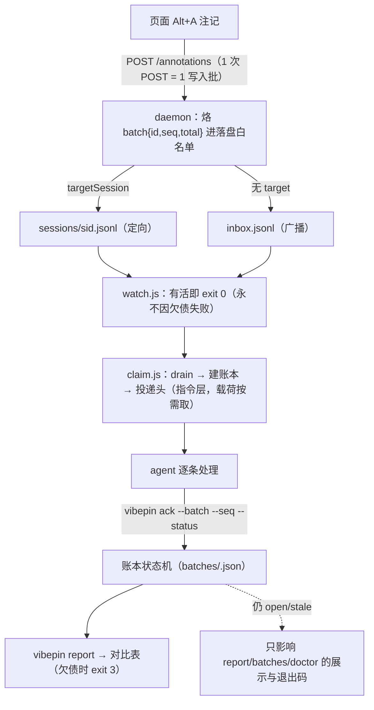

# vibepin 机械式投递协议（Batch Ledger）· v4（v4.1 输出形态修订）

> 状态：**v4 已落地；v4.1 为输出形态修订**（默认 stdout 只投指令层，证据按需取回——协议本体、账本 schema 与投递路径一律不变，只改"投什么"）。本文件是 `vibepin` 仓库内的协议正文，由 v3 设计稿（`local://vibepin-batch-protocol-design.md`）迁入并按 v4 裁决修订；**§10 记录 v3→v4 的全部变更与理由**（对抗审查的 P0 清单），**§10 末尾记录 v4.1**。
> 读者：vibepin 维护者 + 实现代理 + 使用本协议的项目（agent 侧模板见 `adapters/omp/AGENTS.md` / `adapters/omp/SKILL.md`）。
> 相关文档：`docs/20260918-session-routing-design.md`（§4 路由 / §4.4 只读边界 / §4.5 目标路由）、`adapters/omp.md`、`docs/omp-integration.md`。
> 文中 `文件:行` 基于写作当次的快照，**行号会漂，认代码形状不认行号**。

---

## 0. 为什么是"机械式"

### 0.1 现状是播报式，且播报本身会被截断

| 事实 | 证据 |
| --- | --- |
| daemon 把一次 POST 的注记整批落盘，一条 `POST = 一批` | `daemon/daemon.js` 的 POST `/annotations` 处理器（`items.map` 手写白名单） |
| `claim.js` 把整批**一次** `JSON.stringify(items, null, 2)` 打到 stdout | `daemon/claim.js` 的打印点 |
| 该输出**会被截断**：8 条实测 26,229 字节 / 809 行（> 工具输出上限）⇒ 指令和证据一起丢 | 实测（见 §0.4） |
| `watch.js` 唤醒只打一行 `wake: …` 然后 exit 0；"收到多少 / 改了多少"没有任何磁盘状态 | `daemon/watch.js` |
| 认领是**消费型**：rename→archive→unlink，认领后原文件消失 | `daemon/claim.js`、`daemon/store.js` |
| 没有任何"上一批还没结清"的概念，两条注记就能把第一条挤掉 | 本协议要修的主干缺口 |

**结论**：靠 agent 自觉读一大坨 JSON 并"记得汇报"，在输出被截断的那一刻就断了。机械式 = 把"收到多少 / 改了多少 / 还剩多少"搬到**磁盘状态机**：记录烙批号（§1.1）→ 认领建账本（§1.2）→ 欠债在报表里自曝（§3）→ 收尾出对比表（§4.3）。提示词只做辅助（§6.4）。

> **v4 的根本立场**：机械性来自**可见性**，不来自**门禁**。任何"用退出码当互斥锁、挡住投递"的方案都被否决（§10）。

### 0.2 两条端点的硬产出

| 端点 | 硬产出 | 落地 |
| --- | --- | --- |
| **开头**："这批几条、分别是什么" | claim stdout 的**投递头**：总数 + 页面分布 + 来源 + 逐条 digest（编号 `1..N`，即 ack 的键）+ 账本路径 + 协议块 + 载荷取回提示；v4.1 起**不再随后内联完整 JSON** | §2 |
| **结尾**："给用户看的对比表" | `vibepin report --batch <id>`：Markdown 表，**行数 == total**，`open`/`stale` 行标 `!`，未结清时退出码 3 | §4.3 |

### 0.3 机械闭环（唯一真相在磁盘）



一句话：**账本只记录、只展示、只提醒**；`watch`/`claim` 的投递路径**不读账本做判定**，所以"少 ack 一条"不会扣押任何人的注记。

### 0.4 字节预算（防截断是协议的一部分）

- 单条 digest / 未结清行目标 ≤120 字符（`batches.js` 的 `DIGEST_LINE_MAX`）；**原话优先**：原话不会被压到 40 字符以下（`NOTE_MIN_CHARS`，原话本身不足 40 字符则全留），所以定位过长时该行会超过 120 字符；note 在源头截断在 `NOTE_MAX = 160`。默认最多 25 行（`DIGEST_ROWS_MAX`）后折叠。
- **v4.1 的硬指标：默认 stdout 整段 ≤ 3000 字符**（`DELIVERY_CHAR_MAX`，**字符**不是字节）。实测 30 条批：头 5 行 + 载荷提示 3 行 + 22 行 digest + 折叠行 = **2984 字符**，exit 0；v4 的内联 L4 曾把它撑到 1 万+ 字符并被消费端 4000 字符上限截断（"只看到第 1 条"）。
- 超预算时：**折叠行先留位**——打前 N 行 + `… 其余 N 条见 vibepin show --batch <id>`，最后一行永远是真实行或折叠行；**账本永远完整**（stdout 只是视图）。
- 全量载荷（`html`/`styles`/`screenshot`/`rect`/`chain`/`sourcePos`/`container`/`viewport`/`elements`）既不进 digest 也不进默认 stdout，改为 `[e:<processed 行号>]` 指针 + `show --seq N --evidence` / `show --json` 按需取回；`claim --full` 才把头 + digest + 完整 JSON 一起打（调试用）。

---

## 1. 数据 schema

### 1.1 记录新增字段：`batch:{id,seq,total}`（daemon 烙，不是页面给的）

**唯一写入点**：`daemon/daemon.js` 的 POST 处理器里构造 `records` 的白名单字面量（AGENTS.md 的坑：「新增字段必须同时加进 daemon 落盘白名单」）。在 `const records = items.map(...)` 之前生成一次 `batchId`，字面量里加一行 `batch`。

```js
const batchId = `w-${stamp(now)}-${hex4()}`;          // 例：w-20260919-152955-1a2b
const records = items.map((a, i) => ({
  id: a.id || `${now}-${i}`,
  // …既有字段不动…
  batch: { id: batchId, seq: i + 1, total: items.length },   // ← 新增
  inbox: INBOX, projectRoot: PROJECT_ROOT, daemonPort: PORT,
}));
```

规则：

1. **`seq` 从 1 起**（与 overlay 面板/pin 的编号一致）。页面 `id` 后缀是 0 起，只能当 legacy 兜底，**digest/账本的 seq 一律取 `batch.seq`，不解析 id 后缀**。
2. **一个写入批 = 一次 POST**：定向 POST 与广播 POST 分别成批。
3. **`batch.id` 由 daemon 生成，页面不可伪造**（批号是 daemon 的记账，不是页面的字段）。
4. **不改 POST 响应体**（`{ok,received,routed,pending[,target]}` 保持原样），页面只读既有字段。
5. 老记录（无 `batch`）合法：claim/账本按 `writeBatch: null` 处理（§6.1）。
6. **这里是"写入批"，不是 ack 的键**——见 §1.6。

生成函数（`daemon/batches.js`，`stamp(ms)` 用本地时间 `YYYYMMDD-HHMMSS`）：

```js
const hex4 = () => randomBytes(2).toString('hex');       // node:crypto
const stamp = (ms) => { const d = new Date(ms); const p = (n, w = 2) => String(n).padStart(w, '0');
  return `${d.getFullYear()}${p(d.getMonth() + 1)}${p(d.getDate())}-${p(d.getHours())}${p(d.getMinutes())}${p(d.getSeconds())}`; };
```

id 形状（文件系统安全、字典序 = 时间序）：写入批 `w-20260919-152955-1a2b`，认领批 `b-20260919-153012-7f3a`。碰撞（同秒同 hex）→ `newBatchId` 重掷，并保证进程内两次调用不重复。

### 1.2 账本文件：`<proj>/.vibepin/batches/<batchId>.json`

**认领批**（不是页面批）是账本的单位：`claim.js` 一次运行 = 一个认领批，可以合并多个写入批（队列 + 共享 inbox + `--recover` 的孤儿）。

字段表（`v: 1`）：

| 字段 | 类型 | 含义 / 规则 |
| --- | --- | --- |
| `v` | `1` | schema 版本 |
| `id` | `b-…` | 认领批号 = 文件名（不含 `.json`） |
| `kind` | `"claim"` | 预留（`rebuild` 时仍为 `claim`） |
| `sessionId` | `string \| null` | 认领者；`null` = 无会话（仅 `--ledger`，§6.5） |
| `at` | ms | 建账时刻 |
| `closedAt` | `ms \| null` | 首次「无 `open` 项」的时刻；写下后**不清空** |
| `ttlMs` | ms | 本批建立时的阈值快照（默认 `28800000` = 8h，`0` = 不降级） |
| `files` | `[{role,path}]` | 实际 drain 过的文件，`role: "queue" \| "inbox"` |
| `sources` | `{queue,inbox,recovered}` | 条数口径（§5.2） |
| `pages` | `[{url,path,count}]` | 按 `pageKey(url)` 聚合，`count` 降序；和 == `total` |
| `writeBatches` | `[{id,count}]` | 本批覆盖的写入批；`id:null` = 早于本协议的记录 |
| `total` | `number` | == `items.length`（**report 行数的唯一依据**） |
| `items[]` | 见下 | 逐条 |
| `forced[]` | `[]` | v4 不再产生（`--force` 已删，§10）；字段保留以兼容 v3 账本 |
| `rebuilt` | `bool` | 由 `--rebuild` 重建（§6.2） |

`items[i]`：

| 字段 | 类型 | 含义 |
| --- | --- | --- |
| `seq` | `1..total` | **ack 的键**，等于投递头里的 `n.` |
| `id` | `string` | 记录 id（`claims.jsonl` 的键），供 MCP/`--json` 对齐 |
| `status` | 六态之一 | §1.4 |
| `note` | `string` | 原话（首行，≤ `NOTE_MAX`(160)；**权威仍在 processed.jsonl**） |
| `kind` | `"element" \| "region"` | 定位用 |
| `component` | `string \| null` | React/Vue 组件名 |
| `source` | `string \| null` | `文件:行`（第一定位键） |
| `selector` | `string \| null` | 兜底定位 |
| `url` / `page` | `string` | 全 URL / `pageKey` |
| `writeBatch` | `string \| null` | 记录自带的 `batch.id` |
| `sourceFile` | `"queue" \| "inbox" \| "recovered"` | 该条从哪个 channel 来 |
| `evidence` | `{file,line}` | `processed.jsonl` 的**行号**（append-only ⇒ 稳定） |
| `claimedAt` / `updatedAt` | ms | 建账 / 最后一次状态变更 |
| `history[]` | `[{at,by,from,to,note?,reason?}]` | 只追加；`by ∈ claim \| ack \| rebuild` |

**为什么 `evidence.line` 可靠**：`claim.js` 的 archive 顺序恒等于投递顺序（`recover()` 与 `drain()` 都是「先 `archive(fresh)` 再 `out.push(...fresh)`」，`main()` 按 queue→inbox 顺序拼接），所以 `evidence.line = countLines(processed.jsonl)@开工 + 序号`。实现必须在 drain **之前**取一次 `PROCESSED_START`。
（已知边界：`processed.jsonl` 是**项目共享**的，多会话并发 claim 会让行号错位——§9.3。）

### 1.3 账本逐字样例

```json
{
  "v": 1,
  "id": "b-20260919-153012-7f3a",
  "kind": "claim",
  "sessionId": "omp-2f9c1a",
  "at": 1789486212345,
  "closedAt": null,
  "ttlMs": 28800000,
  "files": [{ "role": "queue", "path": "…/.vibepin/sessions/omp-2f9c1a.jsonl" },
            { "role": "inbox", "path": "…/.vibepin/inbox.jsonl" }],
  "sources": { "queue": 2, "inbox": 1, "recovered": 0 },
  "pages": [{ "url": "http://localhost:5173/resume-parse", "path": "/resume-parse", "count": 2 },
            { "url": "http://localhost:5173/settings", "path": "/settings", "count": 1 }],
  "writeBatches": [{ "id": "w-20260919-152955-1a2b", "count": 2 }, { "id": null, "count": 1 }],
  "total": 3,
  "items": [
    { "seq": 1, "id": "1789486155000-0", "status": "done", "note": "按钮太窄，点不到",
      "kind": "element", "component": "ResumeUpload", "source": "frontend/src/views/resume/Upload.vue:120",
      "selector": "div.upload > button.el-button", "page": "/resume-parse",
      "writeBatch": "w-20260919-152955-1a2b", "sourceFile": "queue",
      "evidence": { "file": "processed.jsonl", "line": 412 },
      "claimedAt": 1789486212345, "updatedAt": 1789486241002,
      "history": [{ "at": 1789486212345, "by": "claim", "from": null, "to": "open" },
                  { "at": 1789486241002, "by": "ack", "from": "open", "to": "done",
                    "note": "min-width 96px（Upload.vue:131）" }] }
  ],
  "forced": [],
  "rebuilt": false
}
```

### 1.4 逐条状态机（六态）与批的派生状态

| 起始 | 事件 / 触发命令 | 结束 | 谁写 | 必填 | 时间戳 |
| --- | --- | --- | --- | --- | --- |
| — | claim 建账（每条） | `open` | `claim.js` | — | `claimedAt`、`history[0]` |
| `open` | `ack --status done`（默认） | `done` | `vibepin ack` | `--note` | `updatedAt` |
| `open` | `ack --status wontfix` | `wontfix` | `vibepin ack` | `--reason` | 同上 |
| `open` | `ack --status blocked` | `blocked` | `vibepin ack` | `--reason` | 同上 |
| `open` | `ack --status deferred` | `deferred` | `vibepin ack` | `--reason` | 同上 |
| 六态任一 | `ack --status <s>`（同态重复） | 不变 | `vibepin ack` | — | **不追加 history（幂等）** |
| 任意 | `ack --status open`（重开） | `open` | `vibepin ack` | `--note` | 同上 |
| — | `--rebuild` / 账本丢失重建 | `stale` | `batches.js`（`by:"rebuild"`，reason `ledger-missing`） | — | 同上 |

**v4 删掉了两条转移**：`open --TTL--> stale`（由 claim/watch 过门禁触发）与 `open --force--> stale`（由 `claim --force` 触发）。二者都建立在"投递门禁"之上（§10）。`stale` 现在只剩三个来源：`ack --status stale`（手工显式）、`--rebuild`（账本丢失）、以及**展示层**把过期的 `open` 读作 `stale`（§3.2）。**落盘状态不会被时钟改写。**

语义分类：

- **未结清（欠债，可见）**：`open` 与 `stale`。`report` 行标 `!`、退出码 3；**不挡任何投递**。
- **有交代（不挡、不算欠债）**：`done` / `wontfix` / `blocked` / `deferred`。除 `blocked`/`deferred` 每一批的 `## 未结清` 块会复认外，不再出现在任何提示里。

批的派生状态（**不落盘，纯函数**，实现于 `daemon/batches.js`）：

```js
const rollup = (b) => /* 六态原始计数，零填充 */;
const displayRollup = (b, { now, ttl }) => /* 把"过期的 open"计作 stale */;
const expired = (i, now, ttl) => ttl > 0 && now - i.claimedAt > ttl;
const openCount = (b, { now, ttl }) => /* 未过期的 open 数 */;
const reportExitCode = (b, { now, ttl }) => /* 有任何 open/stale 行 → 3，否则 0 */;
```

`closedAt` 在第一次 `rollup(open) === 0` 时写入（`ack` 写；`claim` 建账时若全空批不建账，见 §4.2）。

### 1.5 谁能改 / 原子写 / 并发

| 角色 | 权限 |
| --- | --- |
| `vibepin ack`（人/agent 显式） | 唯一能改 `status` 的入口 |
| `daemon/claim.js` | 建账；**不碰别的批** |
| `daemon/watch.js` | **只读**（唯一写入仍是租约心跳）。v4 下它**不读账本做任何判定** |
| `daemon/daemon.js` | **永不读写 `batches/`**（页面可达的进程不碰状态） |
| `report` / `batches` / `show` | 只读（`--rebuild` 例外，§6.2） |

- 写 = **temp + rename**：`store.js` 的 `writeJsonAtomic(file, obj)`（`${file}.tmp-${pid}` → rename，`mkdir` 递归），`writeLease()` 也走它 —— 全仓一份原子写实现。
- 并发：`ack` 是 read-modify-write + rename；两个并发 `ack` 的结果是**后写者赢**（不丢行、不撕行）。同一会话应按"单 runner"使用（与单 watcher 假设同级，§9.5）；账本损坏/读不动一律 **fail-open**（§3.5）。

### 1.6 写入批 vs 认领批（两套编号，不要混）

| | 写入批（POST） | 认领批（claim） |
| --- | --- | --- |
| 产生者 | `daemon.js` 的 POST 处理器 | `claim.js` |
| 编号 | `w-…`，烙进**记录**（`batch:{id,seq,total}`） | `b-…`，是**账本文件名** |
| 单位 | 一次 POST | 一次 claim（可含多个写入批 / 多个文件） |
| 建账 | 不建账（只有批号） | `batches/<b-…>.json` |
| ack 的键 | **不参与** | `seq`（1..total） |

投递头把两者都报出来（`写入批 2 个` + 每条 `[e:412/w:1a2b]`），但 **`ack`/`report`/`show` 只认认领批的 `seq`**。agent 侧模板把这条写成明文（"别拿记录里的 `batch.seq` 当 ack 键"）。

---

## 2. 投递头格式（`claim.js` stdout）

### 2.1 分层（v4.1）

| 层 | 内容 | 默认 | `--full` | `--json` |
| --- | --- | --- | --- | --- |
| **L0 协议块** | 批号、总数、页面数、来源、账本路径、逐条 ack 命令、收尾 report 命令 | ✅ | ✅ | ✗ |
| **L1 头** | 默认：5 行 `[vibepin] …`（批号/来源/账本/页面/协议）+ **载荷取回提示 3 行**；`--full`：6 行，末行是 `欠债只记录不挡投递…`（**不带**载荷提示——载荷就在下面） | ✅ | ✅ | ✗ |
| **L2b `## 未结清`** | 更早批次遗留的 `open`/`blocked`/`deferred`（**不重复投递**，附逐条结清命令） | ✅ | ✅ | ✗ |
| **L2 digest** | 每条一行：`seq. [页面 ·] 定位（压缩形） — 原话 [e:<行>/<w 短号>]` | ✅（≤25 行 / 行目标 ≤120 字符 / 整段 3000 字符预算，超出打折叠行） | ✅（不设预算） | ✗ |
| **L3 证据指针** | 每行尾部 `[e:<processed 行号>/<w 短号>]`（= `processed.jsonl` 行号） | ✅ | ✅ | ✗ |
| **L4 全量 JSON** | 裸数组（含 `html/styles/screenshot/…`） | ✗ | ✅（头之后） | ✅（**只有它**，逐字等于协议前） |

- **指令层 = 默认全部（v4.1）**：批号、`total`、页面分布、`sources`、`seq`、定位（`component` + `source` / `selector`）、`note` 首行（≤160 字）、`[e:<行>]` 指针、账本路径、ack/report 命令、载荷取回提示、`## 未结清`。
- **证据层（默认不打印）**：`id`/`ts`/`html`/`styles`/`screenshot`/`rect`/`pin`/`chain`/`sourcePos`/`container`/`viewport`/`elements`/`inbox`/`projectRoot`/`daemonPort`。
- **证据层永不丢失，只是按需取回**：`[e:<行号>]` → `vibepin show --batch <id> --seq <n> --evidence`（逐字等于 `processed.jsonl` 那一行）；整批 → `vibepin show --batch <id> --json`；调试要整包 → `claim --full`。
- **`--brief` 已删（v4.1）**：默认就是指令层；显式传 `--brief` → exit 1（提示改用 `--full`），**不静默回退**。
- **为什么改**：v4 的"头之后仍打完整 JSON"把 stdout 撑到 1 万+ 字符，被消费端 4000 **字符**上限截断（两次真实事故："只看到第 1 条"）。指令层整段 ≤3000 字符，**不会再被截断**。

### 2.2 默认输出逐字样例（3 条 / 2 页 / 队列 2 + 共享 1）

```
[vibepin] 批 b-20260919-153012-7f3a · 3 条 · 2 个页面 · 会话 omp-2f9c1a
[vibepin] 来源 queue 2 · inbox 1 · recovered 0 · 写入批 2 个（w-20260919-152955-1a2b×2 · 无批号×1）
[vibepin] 账本 D:/Develops/proj/.vibepin/batches/b-20260919-153012-7f3a.json
[vibepin] 页面 /resume-parse ×2 · /settings ×1
[vibepin] 协议 ①逐条处理 ②每条 vibepin ack --batch b-20260919-153012-7f3a --seq <n> --status done --note "<file:line>" ③收尾 vibepin report --batch b-20260919-153012-7f3a
[vibepin] 载荷 本批只投递"指令层"（页面 · 组件 · source:line · 原话）。某条的完整证据（selector/html/styles/rect/chain）按需取：
[vibepin]   vibepin show --batch b-20260919-153012-7f3a --seq <n> --evidence   # 该条完整记录（= processed.jsonl:<行号>）
[vibepin]   vibepin show --batch b-20260919-153012-7f3a --json                 # 整批账本
## 未结清（更早批次，未重复投递；逐条结清用下面的 ack 命令）
- b-20260919-142000-33cd#2 [blocked] /resume-parse <EChartsCard> Chart.vue:88 — 图表 hover 提示要换文案（认领于 2026-09-19T14:20:31Z，已 71 分钟）
  ack：vibepin ack --batch b-20260919-142000-33cd --seq 2 --status done --note "<file:line>"

1. /resume-parse · <ResumeUpload> Upload.vue:120 — 按钮太窄，点不到  [e:412/w:1a2b]
2. /resume-parse · FilterBar.vue:44 — 这块整体要和上面那条一样窄  [e:413/w:1a2b]
3. /settings · div.el-dialog__header — 弹窗标题字号偏小  [e:414/-]
```

默认**到此为止**（整段 ≤3000 字符，没有 L4）。无欠债时 `## 未结清` 块**整块不出现**（`show` 重打头时同样不打印该块）。

规则：

- L1 第 1 行永远可 grep：`^\[vibepin\] 批 <id> · <total> 条 · <pages> 个页面`。
- digest 行正则：`^(\d+)\. (?:(\S+) · )?(.*) — (.*?)(  \[e:\d+(?:/[-\w]+)?\])?$`；**页面数 > 1** 才带 `页面 · ` 前缀。
- 定位回落顺序：① `<Component> source` ② `source` ③ `<Component> selector` ④ `selector` ⑤ `▦ region` ⑥ `(无定位信息)`。
- **定位压缩（投递行/债行的渲染）**：打印的是上面选中的那个定位的**压缩形**（`shortLocator`）——路径只留 basename（`src/views/resume/Upload.vue:120` → `Upload.vue:120`），组件名与文件主名相同时只留文件（`<Upload> Upload.vue:12` → `Upload.vue:12`，故 `<FilterBar> FilterBar.vue:44` 打 `FilterBar.vue:44`）。**`report` 的「组件 / source:line」列不受影响，仍打完整定位**（那是给人核对的表）。完整路径从不丢：它在账本与 `processed.jsonl` 里，由 `[e:…]` 指针命名。
- **原话优先**：行的目标长度仍是 120 字符，但原话不会被压到 40 字符以下（`NOTE_MIN_CHARS`；原话本身不足 40 字符则全留）——定位过长时该行会超过 120 字符，这是有意的取舍；整段 3000 字符预算不变。
- `note` 取首行、折叠空白、≤160 字符；空 note 打 `(无原话)`。
- `w` 短号 = 写入批 id 后 4 位；无批号打 `-`。
- `sources.recovered > 0` 时，stderr 额外一行（复用既有语义）：`[vibepin] 恢复 1 条来自中断的认领（orphan .claiming）`。

### 2.3 `--full`（调试用：整包）

= **v4.1 之前的默认形态**：头（6 行，末行是 `欠债只记录不挡投递…`）+ `## 未结清` + digest（带 `[e:…]` 指针，**不设预算**）+ **完整 JSON 数组**。只在排查"头里的定位够不够、载荷长什么样"时用；正常消费不要开——它正是 v4.1 要消灭的截断源（实测 3 条就 5210 字符、30 条更高）。

`--brief`（v4 的"去掉逐条 `[e:…]` 指针"）**已删**：v4.1 的默认输出就是指令层（且指针恒在），显式传 `--brief` → exit 1。`--full` 与 `--json` **互斥**（同时给 → exit 1 `--full and --json are mutually exclusive`），且在建账/投递**之前**就被拒绝。

### 2.4 `--json`（机器契约，逐字等于今天）

- **有 `--session`**：`--json` 打 `JSON.stringify(items, null, 2)`——逐字等于协议前的 stdout（同一个 `items`，同一缩进）。账本照建，只是不打印 L0–L3。
- **无 `--session` 且无 `--ledger`**（legacy 广播用法）：**默认**就是裸数组，逐字等于今天。此路径不建账（没有 ack 主体，§6.5）。
- **空批**：无论有没有会话，stdout 恒为 `[]`（一次 `JSON.stringify([], null, 2)`），exit 0，**不建账**。
- **v4.1 不变**：`--json` 仍只打 JSON，逐字等于协议前的机器面；默认形态从"头 + JSON"变成"只有指令层"不影响它。

### 2.5 `## 未结清` 块（v4 的核心可见性）

由 `claim.js` 在默认与 `--full` 输出里打印（`formatUnsettled(carryOver(...))`，位置在头之后、digest 之前），**`--json` 里不打印**：

```
## 未结清（更早批次，未重复投递；逐条结清用下面的 ack 命令）
- b-20260919-142000-33cd#2 [blocked] /resume-parse <EChartsCard> Chart.vue:88 — 图表 hover 提示要换文案（认领于 2026-09-19T14:20:31Z，已 71 分钟）
  ack：vibepin ack --batch b-20260919-142000-33cd --seq 2 --status done --note "<file:line>"
```

- 取的是**同会话、早于本批**的账本里状态为 `open`/`blocked`/`deferred` 的行（`UNSETTLED_STATUSES`，**不含** `stale`），按时间从旧到新，最多 5 条；超出打 `… 其余 N 条见 vibepin show --batch <id>`。
- 每条带**可直接复制的 ack 命令**；**绝不**打印 `--all-done`（§3.3）。
- 没有遗留 = 不出现这个块。它不是本批要改的条目，是"顺手结清"的清单。

---

## 3. 欠债自曝（**没有门禁**）

> v3 的整章「门禁语义」（watch/claim 因未结清而 exit 3、`--force` 越门禁、TTL 放行）**作废**。原因见 §10（对抗审查的 P0-#1/#2/#3/#4/#10/#12/#16/#18）。本章是 v4 的替代语义。

### 3.1 投递路径的语义（冻结）

| 命令 | 退出码 | 与账本的关系 |
| --- | --- | --- |
| `watch` | `0` = 有活（或超时）；`2` = 读不了被 watch 的文件。**没有 3。** | **不读账本**。有活就 exit 0 让 `claim` 投递——投递活性优先于一切账本逻辑 |
| `claim` | `0` = 已投递（空批 `[]` 也是 0）；`1` = 硬错误（路径不是文件 / bad sid / IO） | 建账本、写 `claims.jsonl`、刷租约；**从不因为"有未结清"而拒绝 drain** |
| `report` | `0` = 全表无 `open`/`stale`；`3` = 还有 `open`/`stale` 行；`1` = 错误 | **只读**。欠债在这里变成退出码（给人/CI 看） |
| `ack` | `0` = 已更新（含幂等 `0 项更新`）；`1` = 未知批/seq、缺 `--note`/`--reason` | 唯一写入口 |
| `batches` / `show` | `0` = 已打印；`1` = 未知批 | 只读 |

- **`watch && claim` 保持原语义**：`watch` 成功唤醒恒 exit 0，`&&` 不会短路；agent 看到的永远是注记（不是训斥）。
- **崩溃自愈不被任何东西挡住**：`claim --recover` 与普通 `claim` 一样直接 drain（v3 的"recover 也要过门禁"已删）。
- **MCP 通道**不受影响（本协议不动 MCP；机械性只在 file 通道，§9.1）。

### 3.2 欠债出现在哪（可见性的三个面）

1. `report`：`!` 前缀 + 表前 banner + 退出码 3（唯一会非零退出的欠债信号）。
2. `batches`：`open` 列（未过 TTL 的 open 计数）、页脚未结清批数。
3. `doctor` 第 ⑤ 项 `批账本`：有未结清 `open` 的批 → 一行 `!` 警告，**不改 exit code**（doctor 只在 `✗` 上退 1）。
4. `claim` 的 `## 未结清` 块（每次投递顺手复认）。

**TTL 是展示阈值**：`--open-ttl <ms>`（默认 `28800000` = 8h；`0` = 从不把 open 读作 stale；亦可用 `ANNOTATE_OPEN_TTL_MS`）。它只影响 `report` 表里的状态列 / 汇总、`report --json` 的 `rollup`、`batches` 的 `open` 列与 `rollup`——**不写盘、不放行、不阻挡**。

### 3.3 `--all-done`（存在，但不在提示里吆喝）

- 语义：把该批**所有 `open`** 一次写成 `done`（`blocked`/`deferred`/`stale` 不动，输出里说明）；与 `--seq`、`--status` 互斥。
- 用途：agent 批量收尾的便利开关。
- **纪律**：任何提示文案（claim 的 `## 未结清`、拒识信息、doctor、模板）**不得**把它印成"下一步"——拒绝给 agent 一条"一次撒谎全批"的抄写路径（P0-#5）。它只出现在 `--help` 里。
- 既然没有门禁，就没有"逃生口"话术：**v4 不存在 `--force`**（`bin/vibepin.js` 不提供，`daemon/**` 也不实现）。

### 3.4 `blocked` / `deferred` 的语义（为什么它们不被催）

- **`deferred` = "以后做"**、**`blocked` = "被外部原因卡住"**：都带 `--reason`，都**不重新投递**（避免重复劳动与重复计数），但每一批的 `## 未结清` 块会复认，所以不会静默消失。
- 要重新投递：`ack --status open --note "为什么重开"` 显式重开（§9.4）。

### 3.5 fail-open 不变量（本协议的宪法）

1. **账本读不动 ≠ 停投**：非法 JSON、缺字段、未知 status、I/O 错误一律当"没有欠债"处理，最多 stderr/`!` 警告。`readBatch` 对缺失与损坏都返回 `null`；`listBatches` **跳过**坏文件并通过 `onWarn` 报告。
2. **会计是旁路**：`daemon.js` 永不读写 `batches/`；`watch.js`/`claim.js` 不因账本内容改变投递行为；`daemon/batches.js` 缺失/损坏时 `bin/vibepin.js` 的 init/doctor/sessions/help 与 watch/claim 透传**照常工作**（CLI 对账本命令懒加载）。
3. **投递活性 > 账本完整性 > 报表美观**。
4. 同一个 sid 的"转世"（关窗重开、崩溃重启）**不继承任何锁**——因为根本没有锁。

---

## 4. CLI（`bin/vibepin.js`）

新增 4 个本地命令（**不进 `TARGETS`**，`TARGETS` 只转发 `daemon/watch/claim`），全部走 `opt()/has()` + `inboxFor()/projectDir()` 与 `daemon/batches.js`。

### 4.1 帮助文本（`node bin/vibepin.js --help` 的正文）

```
vibepin <command> [options]

Commands:
  init      wire the /vpin loop into an agent (--agent claude|codex|cursor|antigravity|omp|all)
  daemon    start the daemon (serves overlay, collects annotations, exposes /mcp)
  watch     block until there is work to claim, then exit (wake primitive)
  claim     drain pending annotations, open a batch ledger and print the instruction-layer delivery header
  ack       settle delivered annotations (done/wontfix/blocked/deferred) — the ledger's only writer
  report    print the per-batch comparison table for the user (exit 3 while open/stale rows remain)
  batches   list claim batches with page count and open count
  show      re-print one batch (add --seq N --evidence to expand a record from processed.jsonl)
  sessions  list sessions with pending counts and last activity
  doctor    diagnose wiring, protocol version, ledger and daemon reachability (exit 1 on defects)

Options:
  --agent <name>   init only: claude (default) | codex | cursor | antigravity | omp | all
  --root <dir>     project root (init --agent omp, ack/report/batches/show/sessions/doctor; default: cwd)
  --vibepin-dir <dir>  init --agent omp only: checkout the printed commands point at (default: this package)
  --dry-run        init: print the plan (including what --upgrade would write), write nothing
  --upgrade        init: rewrite the files that are still on the old protocol
  --inbox <path>   shared inbox (default: ./.vibepin/inbox.jsonl)
  --queue <path|sid>   session queue to watch/claim (default: none — broadcast only)
  --session <sid>  session id to register/claim for, and to filter ack/report/batches (default: the queue file's basename)
  --recover        claim only: recover batches left by an interrupted claim, no live drain
  --ledger         claim only: open a ledger even without --session (otherwise the legacy [] / bare-JSON output)
  --full           claim only: also inline the full JSON payload after the header (debugging)
  --json           claim/show: the JSON array / the ledger verbatim · batches/report: machine-readable
  --open-ttl <ms>  report/batches: age at which a still-open item is shown as stale (default 28800000 = 8h; 0 = never)
  --batch <id|last>    ack/report/show: which ledger (default: the newest batch in the project)
  --seq <n[,n]>    ack/show: which item(s) inside the batch (1-based, as printed in the delivery header)
  --status <s>     ack: done (default) | wontfix | blocked | deferred | open | stale
  --note <text>    ack: what was changed — becomes the 证据 column of the report
  --reason <text>  ack: required for wontfix / blocked / deferred
  --all-done       ack: mark every open item of the batch done in one write
  --all            report: one table per batch
  --open           batches: only batches with an un-expired open item
  --rebuild        report/show/ack: rebuild a missing ledger from claims.jsonl + processed.jsonl
  --evidence       show: with --seq <n>, print that record verbatim from processed.jsonl (the [e:<line>] pointer)
  --group          show: group the digest by write batch
  --record <line>  show: print one raw line of processed.jsonl
  --port N         daemon only (default: 7331)
  --json           sessions only: print JSON

Exit codes:
  watch   0 = work is waiting · 2 = cannot stat a watched file
  claim   0 = delivered ([] when nothing is pending) · 1 = error
  ack     0 = updated · 1 = unknown batch/seq, or a missing --note/--reason
  report  0 = every row settled · 3 = open/stale rows remain · 1 = error
  batches/show  0 = printed · 1 = unknown batch

Notes:
  init copies the claude/codex/cursor command files over any existing ones (that is
  how those agents are upgraded); the omp files (config.json, SKILL.md, the AGENTS.md
  section) are never rewritten without --upgrade.
  every annotation carries batch{id,seq,total} stamped by the daemon; claim writes
  .vibepin/batches/<id>.json, ack is the only writer of its statuses, and report is
  the user-facing table — unsettled rows are visible debt and never block delivery.
  claim's default stdout is the instruction layer only (batch id, seq, locator, note,
  [e:<line>] pointer); the evidence layer is one command away — vibepin show --batch
  <id> --seq <n> --evidence for one record, vibepin show --batch <id> --json for the
  whole ledger. --full inlines the payload for debugging.
  the ack key is the seq printed in the delivery header (1-based), not a record's own
  batch.seq: one claim can merge several write batches into one ledger.
```

（与 v3 稿的差异：删掉 `--force`、删掉 watch/claim 的 `3 = unsettled`、`--open-ttl` 从"投递资格"改为"报表阈值"、补上 `--all/--open/--evidence/--group/--record` 与 `--port` 的文档。**v4.1**：`--brief` 删除、新增 `--full`、`claim` 说明改为"打印指令层投递头"、`--evidence` 点明取回的是 `[e:<行>]` 指针的目标。）

上面这段必须与实际 `node bin/vibepin.js --help` 输出逐字一致（改帮助文本时同步本节）。

### 4.2 `ack`

```
vibepin ack --batch <id|last> [--seq <n[,n]>] [--status <s>] [--note <t>] [--reason <t>] [--all-done] [--rebuild]
```

- `--batch` 缺省 = 项目里最新的账本（给了 `--session <sid>` 时 = 该会话最新的）；`last` 显式取最新。找不到 → exit 1 `unknown batch: <id>` 并列出最近 3 个批号。
- `--seq` 支持重复与逗号（`--seq 2 --seq 3` / `--seq 2,3`）；越界 → exit 1 `batch b-… has N items (seq 1..N)`，**账本一字不改**。
- 状态默认 `done`；`done` 需 `--note`；`wontfix|blocked|deferred` 需 `--reason`；`open|stale` 需 `--note`。二者皆缺 → exit 1。
- `--all-done` = 该批所有 `open` 一次写成 `done`；与 `--seq`/`--status` 互斥（同时给 → exit 1）。
- 幂等：对已是 `done` 的 seq 再 `--status done` → `0 项更新`（exit 0），`history` 不追加。
- 成功输出（stdout）：

```
1 项更新：b-20260919-153012-7f3a#2 → done（剩余 open 1）
批 b-20260919-153012-7f3a 已结清（closedAt 2026-09-19T15:41:02Z）
```

  全批结清才追加第二行；若 `open` 已清零但仍有 `stale` 行，改打
  `批 <id> 已无 open 项，但仍有 N 行未结清（stale #3）—— vibepin report --batch <id>`（不谎报"已结清"）。
- **v4 无 `--force`**：没有任何需要越过的门禁。

### 4.3 `report`（给用户看的对比表）

```
vibepin report [--batch <id|last>] [--session <sid>] [--all] [--json] [--rebuild]
```

- 缺省 = 项目最新批（`--session` 时 = 该会话最新批）；`--all` = 每批一张表（`--all` 与 `--batch` 互斥）。
- **行数必须 == `total`**：表体只由 `items` 生成，`total = items.length` 由 claim 建立，因此天然成立；`--json` 也返回 `rows.length === total`。
- `open`/`stale`（含"过期 open"的展示态）行在 seq 列加 `!`，表前加 banner。
- 逐字样例：

```
vibepin report — 批 b-20260919-153012-7f3a（会话 omp-2f9c1a · 2026-09-19T15:30:12Z · 3 条）
账本 D:/Develops/proj/.vibepin/batches/b-20260919-153012-7f3a.json

⚠ 2 行未结清（seq 2, 3）—— 全部结清后本命令退出码才会变成 0

| seq | 页面 | 组件 / source:line | 原话 | 状态 | 证据 |
| --- | --- | --- | --- | --- | --- |
| 1 | /resume-parse | <ResumeUpload> frontend/src/views/resume/Upload.vue:120 | 按钮太窄，点不到 | done | 2026-09-19T15:41:02Z 把按钮 min-width 提到 96px（Upload.vue:131） |
| !2 | /resume-parse | <FilterBar> frontend/src/views/resume/FilterBar.vue:44 | 这块整体要和上面那条一样窄 | open | — |
| !3 | /settings | div.el-dialog__header | 弹窗标题字号偏小 | stale | 2026-09-19T15:52:10Z ledger-missing |

3 行（= total）· done 1 · open 1 · stale 1 · wontfix 0 · blocked 0 · deferred 0
证据文件：processed.jsonl:412-414 · 展开原始载荷：vibepin show --batch b-20260919-153012-7f3a --json
```

- 退出码：`0` 全表无 `open`/`stale`；`3` 有 `open` 或 `stale`；`1` 错误（未知批、账本读不动）。`blocked`/`deferred`/`wontfix` **不**改退出码。
- 汇总行与 `--json` 的 `rollup` 用 **display 口径**（过期的 `open` 计入 `stale`），与表体的状态列、`batches` 的 `open` 列三方一致。
- `--json`：`{ "batch": "<id>", "sessionId": …, "at": <ms>, "total": 3, "rollup": {…}, "rows": [ {seq,page,locator,note,status,display,evidence} … ] }`；`--all` 时为 `{ "batches": [ … ] }`。`status` = 账本原始状态，`display` = 今天该读的状态（过期 `open` 读作 `stale`）；`evidence` = 证据列文本（该条最后一次带 `--note`/`--reason` 的 ack 渲染），不是 `{file,line}` 指针（那在 `show --json` 的 `items[].evidence` 里）。
- 单元格转义：`|` → `\|`，换行 → 空格。

### 4.4 `batches`

```
vibepin batches [--json] [--session <sid>] [--open]
```

逐字样例：

```
vibepin batches — D:/Develops/proj/.vibepin/batches（3 个账本）

id                        at                    count  pages  open  session
b-20260919-153012-7f3a    2026-09-19T15:30:12Z      3      2     1  omp-2f9c1a
b-20260919-142000-33cd    2026-09-19T14:20:00Z      5      1     0  omp-2f9c1a
b-20260919-120500-9e10    2026-09-19T12:05:00Z      2      2     0  (no session)

3 个 · 未结清 1 最新：b-20260919-153012-7f3a
对比表：vibepin report --batch b-20260919-153012-7f3a    ·    未结清项：vibepin show --batch b-20260919-153012-7f3a
```

- 按 `at` **倒序**；`open` 列 = `openCount`（**未过 TTL** 的 `open`）；`--open` 只列 `open > 0` 的批；页脚"未结清"= `reportExitCode === 3` 的批数（含只有展示态 stale 的批）。
- `--json`：`{dir, batches:[{id,at,sessionId,total,pages,open,rollup,closedAt}]}`（`at`/`closedAt` 为 ms；`rollup` 为 display 口径）。
- 退出码 `0`（含"没有账本"）；`1` 仅当目录不可读。

### 4.5 `show`

```
vibepin show [--batch <id|last>] [--seq <n[,n]>] [--json] [--evidence] [--group] [--record <line>]
```

- 默认：重打该批的投递头 + digest，每行**后缀状态**：`2. FilterBar.vue:44 — 这块整体要和上面那条一样窄  [e:413/w:1a2b] [done]`（`show` 打的是**账本原始状态**；TTL 展示态只在 `report`/`batches` 里生效）。digest 走同一个 `formatDigest`，所以**定位同样是压缩形**（`FilterBar.vue:44`）。头走 `formatHeader` 的 6 行版（末行是中性欠债说明 `欠债只记录不挡投递：结清用 vibepin ack，进度看 vibepin report`），**不带**载荷取回提示；`show` **不打印** `## 未结清` 块。digest 恒带 `[e:…]` 指针、不设字符预算（`show` 是显式取回命令，读的人已经知道它会很长）。
- `--seq 2`：只打第 2 条（含 `history` 摘要）。
- `--seq 2 --evidence`：从 `processed.jsonl` 第 `evidence.line` 行取原始 JSON 并**逐字打印**（`--json` 时不再二次包装）。这就是 digest 里 `[e:412]` 指针的目标；行号越界/文件缺失 → exit 1 `evidence line 412 is gone (… has 300 lines)`。
- `--json`（无 `--seq`）：打印账本原文（缩进 2，与文件逐字一致）。
- `--seq N --json`：打印该条的账本对象。
- `--group`：按写入批分组再打 digest（`— w-… (2)` / `— 无批号 (1)`）。
- `--record <line>`：直接按 `processed.jsonl` 行号取（比 `--seq` 更底层，覆盖批协议之前的历史记录）。
- `--brief` **已删（v4.1）**：digest 恒带 `[e:<行>]` 指针（它就是载荷的取回入口）；显式传 → exit 1。
- 未知批号 → exit 1（并提示 `vibepin batches`）。

### 4.6 `--rebuild`（账本缺失时的重建）

`report`/`show`/`ack` 带 `--rebuild`；`show --batch <id>` 发现账本不存在但 `claims.jsonl` 里有该 `batchId` 的行时**自动**重建，并打一行
`[vibepin] 账本缺失，已从 claims.jsonl + processed.jsonl 重建（所有项记 stale/ledger-missing）`。

**三种"查无此批"必须可区分**（只有第二个才是真的 unknown）：

| 情形 | `report` / `ack`（不带 `--rebuild`） | `show` |
| --- | --- | --- |
| 账本在 | 正常 | 正常 |
| **账本文件不在，但 `claims.jsonl` 有该 `batchId`** | exit 1，提示 `账本缺失：batch <id> 的账本文件不在，但 claims.jsonl 里有这一批 —— 可以重建：vibepin report --batch <id> --rebuild（ack 同理；show 会自动重建）`——**绝不**说 `unknown batch`，也**绝不**偷偷写盘 | 自动重建后正常输出 |
| 账本不在，`claims.jsonl` 里也没有 | exit 1 `unknown batch: <id>`（附最近 3 个批号） | 同左 |

步骤：

1. `claims.jsonl` 里找 `batchId === <id>` 的行（**这是 `batchId` 必须写进 claims 行的原因**）。找不到 → exit 1 `unknown batch: <id>`。
2. 用该行 `ids[]` 顺序 + `processed.jsonl` 全量扫一次（按 `id` 建索引）恢复 `items`：`seq = 1..N`（按 processed 出现顺序）、`status = "stale"`、`history = [{at, by:"rebuild", from:null, to:"stale", reason:"ledger-missing"}]`、`evidence = {file,line}`、`sourceFile = "inbox"`；`note/component/source/selector/url/page` 从记录取。
3. `sessionId`/`at` 取 claims 行；`sources = {queue:0, inbox:N, recovered:0}`；`pages`/`writeBatches` 现场聚合；`rebuilt: true`。
4. 原子写回 `batches/<id>.json`，并在 stdout 打警告。

**为什么全记 `stale`**：账本丢了 = 状态丢了。不能猜成 `open`（会变成永远清不掉的欠债），也不能猜成 `done`（会假装干完了）。`stale` = 可见的欠债 + `report` 退出码 3 + 可被逐条 `ack` 结清。

### 4.7 `init` 的 Next 块

`vibepin init --agent omp` 打印的循环命令后追加一行：

```
  3. after claim prints a delivery header: fix each item, then `npx vibepin ack --batch <b-…> --seq <n> --note "<file:line: what changed>"` per item, and finish with `npx vibepin report --batch <b-…>` (exit 3 while rows stay open/stale).
```

---

## 5. 跨页 / 多会话 / 定向队列

### 5.1 批以"认领"为单位，不以页面为单位

一次 `claim.js` 可能同时收到：本会话定向队列 + 共享 inbox（广播），再叠加 `--recover` 的孤儿批。它们**合成一个认领批**（一个 `b-…`、一套 `seq 1..N`、一个 `report` 表）。跨页（同一 SPA 的两个路由）也在这一个批里，靠 digest 的 `页面 · ` 前缀 + L1 的 `页面 … ×n` 区分。

### 5.2 `sources` 计数口径

| 键 | 口径 |
| --- | --- |
| `queue` | 从 `--queue`（`sessions/<sid>.jsonl`）drain 来的条数（含该文件的 orphan `.claiming` 恢复） |
| `inbox` | 从 `--inbox` drain 来的条数（含 orphan 恢复） |
| `recovered` | 上述两者中来自 `recover()`（`.claiming` 孤儿）的条数，是 `queue`/`inbox` 的**子集**，不计入和 |

不变量：`sources.queue + sources.inbox === total`；`recovered ≤ total`。定向注记**不会**在 inbox 留影子副本，所以不会双计；万一同一 id 同时出现在两个文件，`keepFresh` 的 `delivered` 与 `claims.jsonl` 双重去重保证只在最先 drain 的文件里计数一次（队列在前）。

### 5.3 多会话

- 账本按 **`sessionId`** 归属与筛选（`batches`/`report`/`ack` 的 `--session`）；一个会话的欠债**不**影响另一个会话——因为它本来就不挡任何投递。
- 广播注记归**第一个 claim 的会话**（现行为不变）；它此后只属于那个批（id 已进 `claims.jsonl`，其他会话不会再看到）。
- 多会话共存的可见性：`vibepin batches` 的 session 列 + 页脚 + `doctor` 的账本检查。

### 5.4 `pageKey`

```js
function pageKey(url) {
  try {
    const u = new URL(url);
    if (u.hash && u.hash.startsWith('#/')) return u.hash.slice(1);   // hash 路由：/#/a 与 /#/b 不能并成 /
    return u.pathname || '/';
  } catch { return url; }
}
```

`pages[].url` 保留该组**第一次**出现的完整 URL，`path` 是 `pageKey`。

---

## 6. 兼容与迁移

### 6.1 历史 `processed.jsonl`（无 `batch` 字段）

- 记录缺 `batch` → `item.writeBatch = null`，digest 的证据后缀打 `/-`，`writeBatches` 里出现 `{id:null,count:N}`，L1 显示 `无批号×N`。
- **不重建**历史记录的批号（无法知道原始 POST 分组），只在 `batches` 页脚提示历史条数（`vibepin show --record <行号>` 可查）。
- 老 `claims.jsonl` 行（无 `batchId`）照常被 `claimedIdSet` 读取（只读 `ids`），不参与重建。

### 6.2 重建

见 §4.6。

### 6.3 明确不动的边界（安全面）

以下**一字不改**：

- 路由规则与两文件布局（queue vs inbox、no-shadow-copy、`store.append(..., {sid})`）。
- 租约 schema 与原子写（只做 §1.5 的等价抽提）。
- `GET /health` 字段集与 `GET /sessions` 白名单；**不新增 HTTP 写接口**。
- CORS 头、`routed.jsonl` 记录形状。
- MCP 三个工具与其返回形状。
- `watch.js` 的 `{size,mtimeMs,ino}` 判定与 `absentIsNormal`。
- 队列文件**永不重写**；认领是 rename→archive→unlink，`unlink` 在 `archive` 之后（崩溃安全，别调序）。
- `.vibepin/*` 已被 `init` 写进 `.gitignore`，`batches/` 天然不入库。
- **账本永不进 HTTP**：`show --json` 会打出 `note`/`source`/`files[].path`，那是 agent 侧视图；任何页面可达接口都不得暴露账本内容（不变量，不只是"本期不改"）。
- `daemon.js` 永不读写 `batches/`。

### 6.4 agent 侧模板与协议版本

- `adapters/omp/AGENTS.md` / `adapters/omp/SKILL.md`：协议从三步改为**四步**——**收到投递头 → 逐条改 → 逐条 `vibepin ack` → 收尾 `vibepin report`**；写明投递头字段表、账本路径、`## 未结清` 块含义、`--note` 写 `file:line` 的约定、`batch.seq ≠ ack seq`、`batches/` 已 gitignore，以及**投递不会因欠债被阻塞（v4）**。
- 版本标记 `bin/vibepin.js` 的 `MARKER` = `<!-- vibepin:batch-ledger-v4 -->`：**标记代际 = 协议代际**（账本 schema 本身仍是 `v: 1`）。v4.1 改了 claim 的默认输出，标记必须跟着升 —— 否则装过 v4.0 模板的项目跑 `init --agent omp --upgrade` 会被判成「already batch-ledger-v3」、一个文件都不重写，项目侧 AGENTS.md / SKILL.md 会永远停在 v4.0 文本（这正是该标记存在的意义）。模板改了就要升级标记：`init --agent omp` 对旧标记报 OLD protocol 并提示 `--upgrade`；`--upgrade` 只重写 SKILL.md 与 AGENTS.md 的注记节两处；`doctor` 对没升级的项目打 `!` 警告（**不改 exit code**，也不是投递门禁）。
- `doctor` 第 ⑤ 项 `批账本`（**只 `!` 警告，不改 exit code**）：

```
! 批账本 2 个批，1 个未结清（其中 1 项超过 8h 仍未结清）：b-… 还有 seq 1,2 —— 逐条结清：vibepin ack --batch b-… --seq 1 --note "改了什么（file:line）"；对比表：vibepin report --batch b-…
```

  条件：某账本存在 `status === 'open'` 的条目。**不打印 `--all-done`**。

### 6.5 无会话（legacy 广播）路径

| 调用 | 输出 | 账本 | 备注 |
| --- | --- | --- | --- |
| `claim --inbox X` | 裸 JSON 数组，逐字同今天 | 不建 | 最常见的老用法，逐字兼容 |
| `claim --inbox X --ledger` | 投递头（`会话 (none)`，`sessionId:null`） | `batches/<b-…>.json` | 给"没有 watcher/会话、但想要账本与对比表"的用法 |

`null` 会话与具名会话互不干扰；`ack --batch <id>` 照常可用（`ack` 的"最新批"在给了 `--session` 时才按会话筛选）。

---

## 7. 验收清单（可观察行为）

> 测试由批账本核心实现方独占维护（`tests/p3-batch-protocol.test.mjs`、`daemon/daemon.sessions.test.mjs`、`tests/p0-session-routing.test.mjs` 的 fixture 更新）。本节只列行为口径，不重复实现。

| # | 断言（可观察，不是实现） |
| --- | --- |
| A | claim（`--session`）跑完：`batches/` 恰好 1 个文件；每项 `evidence.line` 指向 `processed.jsonl` 的对应行且该行 `id` 一致 |
| B | claim 默认 stdout：首行匹配 `^\[vibepin\] 批 b-\d{8}-\d{6}-[0-9a-f]{4} · 3 条 · 2 个页面`；digest 行数 == 3 且每行带 `[e:<行>/…]`；含账本绝对路径、`ack --batch <id> --seq` 与载荷取回提示；**头之后没有 JSON**（stdout 不含 `\n[\n`） |
| C | `--full`：头 + digest + **完整 JSON 数组**（= v4.1 之前的默认形态）；`--brief` → exit 1、stdout 里没有 digest |
| D | `--json`：`JSON.parse(stdout)` 的 id 顺序 == 投递顺序，且与协议前实现逐字相同 |
| E | **投递永不因欠债被挡**：批 A 有 `open` 时追加 2 条 → `watch` **exit 0**、`claim` **exit 0** 并新建批 B（total == 2）；A 的欠债只出现在 `## 未结清`/`report`/`batches` |
| F | 状态机：`--status wontfix` 缺 `--reason` → exit 1 且账本未变；`--status done` 缺 `--note` → exit 1；`--seq 99` → exit 1 且账本未变；重复 `--status done` → exit 0 且 `history` 长度不变 |
| G | `report --batch A`：数据行数 == `total`；`open`/`stale` 行 `!` 开头、banner 列出这些 seq；有 `open`/`stale` 时 exit 3，全结清后 exit 0；`--json` 的 `rows.length === total` |
| H | `--open-ttl 1`：`report` 的状态列/汇总与 `batches --json` 的 `rollup` 把过期 `open` 记为 `stale`；**`watch`/`claim` 行为与退出码完全不变** |
| I | `show --batch A --seq 2 --evidence` 输出逐字 == `processed.jsonl` 第 2 行；`show --batch A --json` 逐字 == 账本文件内容 |
| J | 重建：删掉 `batches/A.json` → `report --batch A --rebuild` exit 3、行数 == 原 `total`、全部 `stale` 且 `reason === "ledger-missing"`、账本被写回；`--batch ghost` → exit 1 |
| K | 兼容：手工写一个无 `batch` 字段的 inbox → claim 正常投递、digest 后缀 `/-`、L1 含 `无批号×1` |
| L | 空批：无 pending → claim stdout 逐字 `[]`、exit 0、不建账 |
| M | fail-open：把某账本写成非法 JSON → `batches`/`report`/`doctor` **不崩**（跳过 + 警告），`watch`/`claim` 照常投递 |
| N | doctor：有 `open` 账本时打 `批账本` `!` 警告但 **exit 0**（除非另有 `✗`） |
| O | 缺账本但 `claims.jsonl` 有该批：`report`/`ack`（不带 `--rebuild`）exit 1、提示含 `--rebuild` 且**不含** `unknown batch`、不写盘；`--rebuild` 后放行；`claims.jsonl` 也没有的批号 → `unknown batch` exit 1（p3 `T15b`） |
| P | **默认 stdout ≤ 3000 字符（v4.1 核心验收）**：3 条样例与 40 条上限样例的 `stdout.length <= 3000`；stdout **不含**内联 JSON（无 `\n[\n`）；digest 仍带 `[e:…]` 指针、账本路径与 ack/report 命令仍在（截断事故的回归防线） |
| Q | **证据按需取回（v4.1 的取回入口）**：取默认投递头里第 n 条的 `[e:<行>]` 行号 → `show --batch <id> --seq <n> --evidence` 的 stdout **逐字等于** `processed.jsonl` 第 `<行>` 行、exit 0、不写盘；整批取回 `show --batch <id> --json` 逐字等于账本文件 |
| R | **定位压缩（digest/债行）**：`src/views/resume/Upload.vue:120` 打 `Upload.vue:120`，`<Upload> Upload.vue:12` 打 `Upload.vue:12`（组件名 == 文件主名），selector 型定位原样；`[e:…]` 指针不变；`report` 的「组件 / source:line」列**仍打全路径**；原话被压时不少于 40 字符（不足则全留），故行可能略超 120 字符 |

---

## 8. 落点（实现位置，认形状不认行号）

| 文件 | 性质 | 内容 |
| --- | --- | --- |
| `daemon/batches.js` | **新增** | 账本唯一实现：`batchDir/batchPath/newBatchId/stamp/hex4/readBatch/writeBatch/listBatches/rollup/displayRollup/expired/openCount/reportRows/reportExitCode/carryOver/createBatch/ackItems/rebuildBatch/pageKey/formatHeader/formatDigest/formatUnsettled/formatReport`（无 npm 依赖，风格照 `store.js`） |
| `daemon/store.js` | 修改 | `pathsFor` 增加 `batches`；`writeJsonAtomic` 抽出，`writeLease` 改走它 |
| `daemon/daemon.js` | 修改 | POST 记录白名单新增 `batch:{id,seq,total}`；响应体不动 |
| `daemon/claim.js` | 修改 | `PROCESSED_START` → drain → 建账本 → `claims.jsonl` 行加 `batchId` → 投递头 / `--full` / `--json` / 空批 `[]`；v4.1：`--brief` 删除、默认只投指令层（载荷提示取代内联 JSON） |
| `daemon/watch.js` | 修改 | 只读租约心跳（**不读账本**）；`done(reason, code)` 仍只有 0/2 |
| `bin/vibepin.js` | 修改 | import `batches.js`（懒加载）；`ack`/`report`/`batches`/`show` 四个命令；doctor 第 ⑤ 项 `批账本`；`MARKER` 升级；`init` Next 块加一行；帮助文本换 v4 版（§4.1）；v4.1：`MARKER` 升到 **v4**（`<!-- vibepin:batch-ledger-v4 -->`，init/doctor 文案派生自 `MARKER_GEN`）、帮助文本删 `--brief`、加 `--full`、claim 说明改"指令层投递头"，`show` 去掉 `--brief`（digest 恒带 `[e:…]`，显式传 `--brief` → exit 1） |
| `adapters/omp/AGENTS.md`、`adapters/omp/SKILL.md` | 修改 | 四步协议 + 投递头字段表 + 账本/ack/report 口径 + `batch-ledger-v4` 标记；v4.1：写明默认不再内联完整 JSON、`[e:行]` 是 `processed.jsonl` 行号指针、精确证据按需 `show --seq <n> --evidence` 取回、整段 ≤3000 字符 |
| `tests/p3-batch-protocol.test.mjs` | **新增** | §7 的行为断言 |
| `docs/20260919-batch-ledger.md` | **新增** | 本文件 |

---

## 9. 未决问题 / 已知边界

1. **MCP 通道没有账本**：`daemon/mcp.js` 的 `watch_annotations`/`resolve_annotation` 走内存长轮询 + `store.resolveByIds`，没有"批"的概念。MCP 驱动的 agent 拿不到投递头、也不会出现在 `report` 里。本协议不改 MCP。
2. **`--ledger` 的 null 会话**：`report`/`batches` 里显示 `(no session)`；`ack` 需 `--batch` 精确指定。是否需要 `--ledger <name>` 命名空间，待定。
3. **`evidence.line` 在多会话并发下不是稳定指针**：`processed.jsonl` 是项目共享的，A 取 `PROCESSED_START` 后 B 先 append 会让 A 行号偏移。缓解：`show --record`/`show --seq --evidence` 只用于人工核对；机器对齐用 `item.id`（`claims.jsonl` 的键）。若要根治，应把 `evidence` 从行号改为 `id` 指针（append-only 允许重复，取最后一次）。
4. **`deferred` 的再投递**：当前只复认、不重投；要"下一批重新出现"需要显式的 `claim --retry-deferred`，不在本协议内。
5. **并发假设**：同一会话同时跑两个 `claim`/`ack` 时账本后写者赢（不丢行、不撕行）。要更强保证需锁文件，本协议按"单 runner"假设（与单 watcher 假设同级）。
6. **`report` 的「证据」列格式**：现在是 agent `--note` 的自由文本（约定写 `file:line`）。若要机器可校验，需要 `ack` 里强制格式——留给使用方惯例，`report` 只保证原样呈现。
7. **页面侧回执**：写入批号没有回给页面（响应体不变），用户看到的仍是"Sent 3"。若要在 toast 里显示批号，需动 `core/annotate.js` 与 i18n 文案，属独立的 UI 变更。
8. **`pageKey` 的归一化边界**：query 不同（`?tab=1` vs `?tab=2`）会并成同一页；digest 仍逐条给出完整 URL。
9. **`batches/` 的清理**：账本只增不减；归档/裁剪（`batches --prune --older-than 30d`）不在本协议内。`.vibepin/*` 已 gitignore。
10. **记录上的 `batch{id,seq,total}` 与本协议自己的忠告**：ack 键是认领批 seq，而记录里还带着写入批的 `seq/total`，两者同名不同义。已用 §1.6 + 模板明文消除歧义；若要根治，可把记录字段缩为 `writeBatchId`（不含 seq/total）——属 daemon 落盘面的后续清理。

---

## 10. v3 → v4 变更与理由（对抗审查的 P0）

v3 稿把"未结清"做成**投递门禁**（`watch`/`claim` 以退出码 3 挡住下一批，`--force` 越门禁，TTL 放行）。对抗审查（`local://vibepin-batch-protocol-critique.md`）判定其失效表里 8 行 P0 —— **#1–#7 与 #18**，全部指向同一处：**控制面装在拾取路径上**。v4 的裁决：**只接受旁路对账，会计永不阻断投递。**

| 审查 # | 失效（贴 v3） | v4 的处置 |
| --- | --- | --- |
| **#1** P0 | **同 sid 转世死锁**：claim 建账后崩溃/关窗，下一轮同一 `--session`（skill 强制复用 sid）→ v3 让该 sid 的 claim/watch **exit 3、一条不 drain**，默认 24h | **删门禁**。§3.1：`claim`/`watch` 永不因欠债拒绝投递；同 sid 转世不继承任何锁（§3.5-4） |
| **#2** P0 | **watch 门禁 × 立刻 wake = token 熔断环**：队列有积压时 watch 立刻退出，v3 把它变成 exit 3 → agent 醒来看训斥、按旧 skill re-arm → 立刻再退 3 | `watch` 退出码语义**冻结**为今天（0 = 有活/超时，2 = 读不了文件），**不读账本**（§3.1） |
| **#3** P0 | **`watch && claim` 被拆开**：exit 3 短路 `&&`，唤醒载荷变成拒绝文案而不是注记 | 同上：`watch` 恒 0，`&&` 不再短路（§3.1） |
| **#4** P0 | **`--recover` 被同一把锁封死**：rename 后、ledger 前被杀 → 下次 `claim --recover` 先过门禁，自愈通道要 `--force` | `--recover` 与普通 claim 同路径，**无条件先于一切**（§3.1） |
| **#5** P0 | **`--all-done` 印在拒识文案里**：agent 会把 open 全标 done（撒谎），比 `--force` 更能藏欠债 | 无门禁 → 无拒识文案。`--all-done` 只存在于 `--help`，**任何**提示/模板都不得打印（§3.3） |
| **#6** P0 | **默认 stdout 砍证据**：默认不再打全量载荷，定位（chain/container/elements）要逐条 `show` | v4 的取值：默认 stdout = 投递头 **+ 完整 JSON**；`--brief` 才精简，证据层可用 `show --evidence` 逐条取回。**v4.1 修正**（见本章末）：内联载荷实测会被 4000 字符上限截断，默认改为只投指令层，完整 JSON 移到 `--full` |
| **#7** P0 | **v2 `--session` 路径默认不再是 JSON**：已升级项目在 claim 落地当天 stdout 从数组变中文头，旧 agent `JSON.parse` 失败 | v4 保留"头之后仍是逐字 JSON 数组"；`--json` 逐字等于协议前输出。**v4.1 修正**（见本章末）：默认不再打 JSON 数组，机器面固定为 `--json`（其输出逐字不变） |
| **#18** P0 | **反向失败**：用停泵保证不漏 ack —— 少改一条 → 用户新发的 20 条全扣押 | §3.5 fail-open 宪法：账本坏了/读不动/没 ack，都不影响投递；欠债只影响报表 |
| #10 / #16 P1 | TTL 当锁的钥匙（24h 太长、15min 太短）、`--force` 被抄进每次 claim | **TTL 降级为展示阈值**（§3.2）；`--force` 彻底删除，无消费者（§4.1/§4.2） |
| #12 P1 | `watch --force && claim` 白醒一次（force 不写盘） | 无 force，无两处不一致 |
| #13 P1 | 账本读失败 fail-closed（watch exit 2 ⇒ 该 sid 永不能 park） | `readBatch`/`listBatches` 对坏文件**跳过 + 警告**（§3.5-1） |
| #14 P2 | 老 claims 无 `batchId` 无法 report | `--rebuild` 从 `claims.jsonl` 的 `ids` 重建（全 `stale`，§4.6） |

**仍然照 v3 执行的部分**：批号由 daemon 烙进落盘白名单且响应体不动（§1.1）；账本单位 = 认领批（§1.6）；`sources`/`pages`/`evidence` schema（§1.2）；投递头分层与字节预算（§2）；`report` 的"行数 == total"与 `!` 标记（§4.3）；`ack` 是唯一状态写入口（§1.5）；`--rebuild` 全记 `stale`（§4.6）；`adapters/omp/*` 的会话定向与 `batches/` gitignore（§6.3/§6.4）；跨页 / `pageKey`（§5）。

**v4 新增**：`## 未结清` 块（§2.5，欠债自曝的载体）；`doctor` 第 ⑤ 项（§6.4）；`ack` 的 `--note` 写 `file:line` 的约定（§4.2 + 模板）；`batch.seq ≠ ack seq` 的明文警告（§1.6）。

---

## 10.1 v4.1（输出形态修订，2026-09-19）

v4 的"头之后仍打完整 JSON"（P0-#6/#7 的取值）被实测推翻：完整 JSON 把 stdout 撑到 1 万+ 字符，被消费端的 4000 **字符**上限截断——已两次造成"只看到第 1 条"的真实事故。裁决：

- **默认 stdout 只投指令层**：头（批号/来源/账本/页面/协议）+ **载荷取回提示**（3 行）+ `## 未结清` + digest（含 `[e:<行>/<w 短号>]` 指针），**整段 ≤3000 字符**（§0.4/§2.1/§2.2）。
- **flag 变动**：删 `--brief`（默认即指令层；显式传 → exit 1，**不静默回退**）；新增 **`--full`** = 头 + digest + 完整 JSON（调试用，= v4.1 之前的默认形态）；`--json` 与 legacy（无 `--session`）裸数组**逐字不变**。
- **证据层一字不丢，只按需取回**：`[e:<行>]` 是 `processed.jsonl` 的行号指针；单条 `show --batch <id> --seq <n> --evidence`（逐字等于该行）、整批 `show --batch <id> --json`。
- **不改的东西**：协议本体、账本 schema（`v: 1`）、`batches/` 语义、投递路径与 fail-open 宪法（§3）、`watch`/`claim` 的退出码语义、`report`/`ack` 的逻辑。v4.1 只改"投什么"——落点是 `bin/vibepin.js` 帮助文本 + `adapters/omp/*` 模板 + 本文件。
- **`MARKER` v3 → v4**（`bin/vibepin.js`）：标记代际 = 协议代际，**marker v4 ⇔ 协议 v4.1**。不升标记，`init --upgrade` 对 v4.0 项目无操作（判成 already batch-ledger-v3）→ 新口径送不到项目侧。`init`/`doctor` 的提示文案从 `MARKER` 派生（`MARKER_GEN`），不再各写一份硬编码代际。**这不是门禁**：标记只决定 `init/doctor` 的提示与重写，投递路径一字不动。
- **agent 侧口径**：模板必须写清"默认不再内联完整 JSON、`[e:行]` 是行号指针、需要精确证据（selector/html/styles/rect/chain）时才 `show --seq <n> --evidence`、整段 ≤3000 字符故不会再被截断"，并保留"欠债不挡投递（v4）"与四步闭环。
